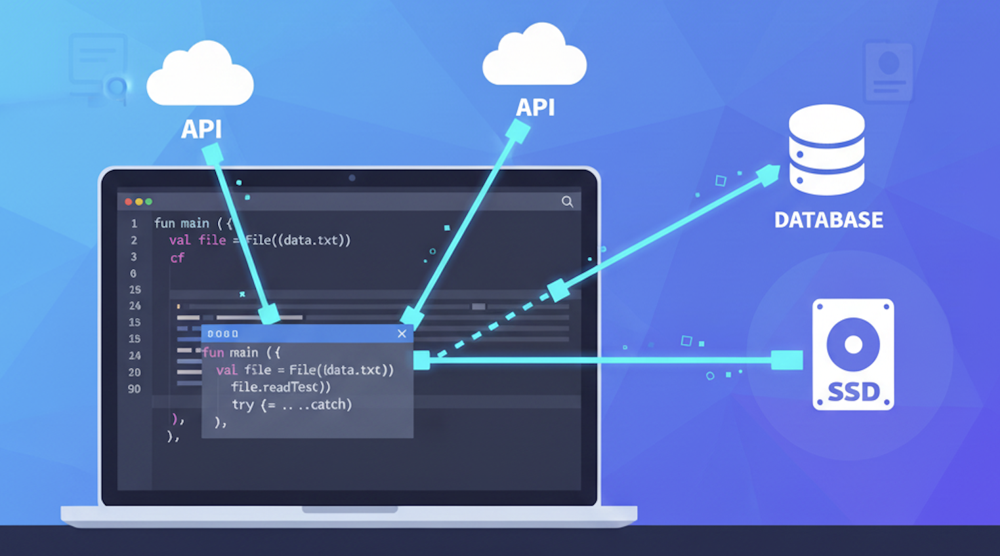

---
hide:
  - navigation
---

# Acceso a datos DAM

## Descripción

Material del módulo de **Acceso a Datos de 2º de DAM del IES CAMP DE MORVEDRE**.

| Fecha      | Versión | Descripción                                |
| ---------- | ------- | ------------------------------------------ |
| 19/09/2025 | 1.0.0   | Adaptación del material. Estructura web con **mkdocs**.|
| 06/01/2026 | 1.1.0   | Ampliación de unidades 3, 4 y 5|

## Enlaces de interés

* Todo el material está disponible en el [repositorio del módulo](https://github.com/jmabadlopez/acceso_datos)

## Autoría y revisión

1. Las unidades **1,2 y 3** están realizadas por **Begoña Paterna** basado en materiales de **Alicia Salvador**. Adaptado, revisado y ampliado por **José Manuel Abad López**.
2. Las unidades **4 y 5** creadas por **José Manuel Abad López**.

Publicada bajo licencia [Creative Commons Atribución/Reconocimiento-CompartirIgual 4.0 Internacional](https://creativecommons.org/licenses/by-sa/4.0/deed.es)

## Repositorio y contacto

<https://jmabadlopez.github.io>
<jmabadlopez@edu.gva.es>
