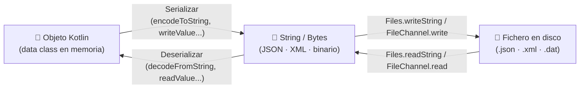

## 4. Ficheros de intercambio de información

Los ficheros de texto en los que la información está estructurada y organizada de una manera predecible permiten que distintos sistemas la lean y entiendan. Estos tipos de ficheros se utilizan en el desarrollo de software para **intercambiar información entre aplicaciones** y algunos de los formatos más importantes son **CSV, JSON y XML**.

Para poder llevar a cabo este intercambio de información, hay que extraer la información del fichero origen. Este proceso no se realiza línea por línea, sino que el contenido del fichero se lee (parsea) utilizando la técnica de **serialización/deserialización**:

* **Serialización**: Proceso de convertir un **objeto en memoria** (por ejemplo, una data class) en una representación textual o binaria (como un String en formato JSON o XML) que se puede guardar en un fichero o enviar por red.
* **Deserialización**: Es el proceso inverso de leer un **fichero** (JSON, XML, etc.) y **reconstruir el objeto original** en memoria para poder trabajar con él.



!!! info "El patrón universal"
    Sea cual sea el formato (CSV, JSON, XML o binario), el flujo es siempre el mismo: **Fichero → Texto/Bytes → Objeto Kotlin** para leer, y **Objeto Kotlin → Texto/Bytes → Fichero** para escribir. Las librerías se ocupan del paso intermedio.

A continuación se describen los 3 tipos de ficheros más comunes para intercambio de información. Se muestran ejemplos de lectura y escritura usando serialización y deserialización utilizando un proyecto con Gradle:

---

### 4.1. CSV (Comma-Separated Values)

Son ficheros de texto plano con valores separados por un delimitador (coma, punto y coma, etc.). Son útiles para exportar/importar datos desde Excel, Google Sheets, o bases de datos. Se manejan con herramientas como OpenCSV (más antigua) o **Kotlin-CSV** (la que utilizaremos).

#### Métodos de Kotlin-CSV

| Método | Ejemplo |
| :--- | :--- |
| `readAll(File)` | `val filas = csvReader().readAll(File("alumnos.csv"))` |
| `readAllWithHeader(File)` | `val datos = csvReader().readAllWithHeader(File("alumnos.csv"))` |
| `open { readAllAsSequence() }` | `csvReader().open("alumnos.csv") { readAllAsSequence().forEach { println(it) } }` |
| `writeAll(data, File)` | `csvWriter().writeAll(listOf(listOf("Pol", "9")), File("salida.csv"))` |
| `writeRow(row, File)` | `csvWriter().writeRow(listOf("Ade", "8"), File("salida.csv"))` |
| `writeAllWithHeader(data, File)` | `csvWriter().writeAllWithHeader(listOf(mapOf("nombre" to "Eli", "nota" to "10")), File("salida.csv"))` |
| `delimiter`, `quoteChar`, etc. | `csvReader { delimiter = ';' }` |

#### Ejemplo 5. Lectura y escritura de ficheros CSV

Partimos de un fichero llamado [mis_plantas.csv](../../assets/resources/mis_plantas.csv) con la información siguiente:

```bash
1;Aloe Vera;Aloe barbadensis miller;7;0.6
2;Lavanda;Lavandula angustifolia;3;1.0
3;Helecho de Boston;Nephrolepis exaltata;5;0.9
4;Bambú de la suerte;Dracaena sanderiana;4;1.5
5;Girasol;Helianthus annuus;2;3.0
```

Como puedes observar el carácter delimitador que separa los campos del CSV es un punto y coma (`;`) y los campos que representan la estructura de una planta son los siguientes:

* `id_planta` (Int)
* `nombre_comun` (String)
* `nombre_cientifico` (String)
* `stock` (Int)
* `precio` (Double)

> Puedes descargar el fichero desde este enlace: [mis_plantas.csv](../../assets/resources/mis_plantas.csv){:mis_plantas.csv} y guardarlo en una carpeta llamada `datos` que deberás crear en la raíz del proyecto de IntelliJ (al mismo nivel que la carpeta `src` y que el archivo `build.gradle.kts`).

Para que nuestra aplicación pueda utilizar las funciones de la librería **Kotlin-CSV** hemos de configurar la dependencia correspondiente en el archivo `build.gradle.kts`. Esta es la línea que hay que añadir:

```kotlin
dependencies {
    implementation("com.github.doyaaaaaken:kotlin-csv-jvm:1.9.1")
}
```

> Recuerda hace clic en el botón de sincronizar dependencias para que **Gradle** se las descargue o no podrás utilizar sus funciones.

El siguiente código lee la información del fichero `plantas.csv`, la muestra por pantalla y la escribe en otro fichero llamado `plantas2.csv` dentro de la misma carpeta.

```kotlin
import java.nio.file.Path
import java.io.File
import java.nio.file.Files

import com.github.doyaaaaaken.kotlincsv.dsl.csvReader
import com.github.doyaaaaaken.kotlincsv.dsl.csvWriter

// Data class que modela la estructura de la planta
data class Planta(
    val idPlanta: Int,
    val nombreComun: String,
    val nombreCientifico: String,
    val stock: Int,
    val precio: Double
)

fun main() {
    gestionCSV()
}

fun gestionCSV(){

    val entradaCSV = Path.of("datos", "mis_plantas.csv")
    val salidaCSV = Path.of("datos", "mis_plantas2.csv")

    // Leer los datos estructurados del CSV y guardarlos en una lista de objetos Planta
    val datos: List<Planta> = leerDatosCSV(entradaCSV)

    // Mostrar por consola la información deserializada
    println("--- Información de la lista de objetos Planta")
    for (dato in datos) {
        println("  - ID: ${dato.idPlanta}, Nombre común: ${dato.nombreComun}, Científico: ${dato.nombreCientifico}, Stock: ${dato.stock} unidades, Precio: ${dato.precio}€")
    }

    // Guardar una copia procesada en un nuevo fichero CSV
    escribirCSV(salidaCSV, datos)

}

fun leerDatosCSV(ruta: Path): List<Planta> {
    var plantas: List<Planta> = emptyList()

    if (!Files.isReadable(ruta)) {
        println("Error: No se puede leer el fichero en la ruta: $ruta")
    } else {
        val reader = csvReader {
            delimiter = ';'
        }

        // Leemos todas las filas del CSV (devuelve List<List<String>>)
        val filas: List<List<String>> = reader.readAll(ruta.toFile())

        // Convertimos las filas de texto en objetos Planta válidos
        plantas = filas.mapNotNull { columnas ->
            if (columnas.size >= 5) {
                try {
                    val idPlanta = columnas[0].toInt()
                    val nombreComun = columnas[1]
                    val nombreCientifico = columnas[2]
                    val stock = columnas[3].toInt()
                    val precio = columnas[4].toDouble()
                    Planta(idPlanta, nombreComun, nombreCientifico, stock, precio)
                } catch (e: Exception) {
                    println("Fila inválida ignorada: $columnas -> Error: ${e.message}")
                    null
                }
            } else {
                println("Fila con formato incompleto ignorada: $columnas")
                null
            }
        }
    }
    println("--- Información leída con éxito de: $ruta")
    return plantas
}

fun escribirCSV(ruta: Path, plantas: List<Planta>) {
    try {
        val fichero: File = ruta.toFile()
        csvWriter {
            delimiter = ';'
        }.writeAll(
            plantas.map { planta ->
                listOf(
                    planta.idPlanta.toString(),
                    planta.nombreComun,
                    planta.nombreCientifico,
                    planta.stock.toString(),
                    planta.precio.toString()
                )
            },
            fichero
        )
        println("--- Información guardada con éxito en: $fichero")
    } catch (e: Exception) {
        println("Error al escribir el fichero CSV: ${e.message}")
    }
}
```

!!! success "Prueba y analiza el ejemplo"
    Prueba el código de ejemplo y verifica que la salida por consola es:

    ```text
    --- Información leída con éxito de: datos\plantas.csv
    --- Información de la lista de objetos Planta
    - ID: 1, Nombre común: Aloe Vera, Científico: Aloe barbadensis miller, Stock: 7 unidades, Precio: 0.6€
    - ID: 2, Nombre común: Lavanda, Científico: Lavandula angustifolia, Stock: 3 unidades, Precio: 1.0€
    - ID: 3, Nombre común: Helecho de Boston, Científico: Nephrolepis exaltata, Stock: 5 unidades, Precio: 0.9€
    - ID: 4, Nombre común: Bambú de la suerte, Científico: Dracaena sanderiana, Stock: 4 unidades, Precio: 1.5€
    - ID: 5, Nombre común: Girasol, Científico: Helianthus annuus, Stock: 2 unidades, Precio: 3.0€
    --- Información guardada con éxito en: datos\plantas2.csv
    ```

!!! example "Autoevaluación"

    **Pregunta 9: El siguiente fragmento lee el CSV de videojuegos. ¿Qué ocurre si la tercera fila del fichero contiene `3;Hades;Roguelike;abc;9.3` (el año no es un número)?**

    ```kotlin
    plantas = filas.mapNotNull { columnas ->
        if (columnas.size >= 5) {
            try {
                val id    = columnas[0].toInt()
                val titulo = columnas[1]
                val genero = columnas[2]
                val anio  = columnas[3].toInt()   // ← "abc" aquí
                val nota  = columnas[4].toDouble()
                Videojuego(id, titulo, genero, anio, nota)
            } catch (e: Exception) {
                println("Fila inválida: $columnas")
                null
            }
        } else null
    }
    ```

    A) El programa lanza una excepción `NumberFormatException` y se detiene completamente.

    B) La fila inválida se registra con un mensaje en consola y se omite; el resto de filas se procesan con normalidad.

    C) `mapNotNull` convierte automáticamente `"abc"` en `0` para no perder la fila.

    D) El bloque `try-catch` es ignorado por `mapNotNull`, que siempre propaga las excepciones.

    ??? quote "Solución"
        ❌ A) El bloque `try-catch` captura la excepción antes de que se propague. El programa no se detiene.

        ✅ B) `toInt()` lanza `NumberFormatException` al intentar convertir `"abc"`. El `catch` captura ese error, imprime el aviso y devuelve `null`. `mapNotNull` descarta ese `null` y continúa con el resto de filas.

        ❌ C) `mapNotNull` no hace ninguna conversión de tipos. Simplemente ignora los valores `null` que devuelve el bloque; la conversión errónea la maneja el `try-catch`.

        ❌ D) `mapNotNull` no interfiere con el manejo de excepciones. El `try-catch` funciona con normalidad dentro del lambda.

    **Pregunta 10: El fichero `videojuegos.csv` usa `;` como separador. ¿Qué sucede si se usa `csvReader().readAll(File("videojuegos.csv"))` sin configurar el delimitador?**

    A) La librería detecta el delimitador automáticamente y lee el fichero sin problemas.

    B) El programa lanza una `IOException` al no reconocer el delimitador `;`.

    C) Cada fila se interpreta como una única columna, ya que el lector usa `,` por defecto y no encuentra ninguna coma.

    D) La librería convierte los `;` en `,` internamente antes de parsear.

    ??? quote "Solución"
        ❌ A) Kotlin-CSV no detecta el delimitador automáticamente. Por defecto siempre usa `,`.

        ❌ B) No se lanza ninguna excepción; la librería simplemente no encuentra el separador esperado y procesa el fichero de forma incorrecta.

        ✅ C) Al usar `,` por defecto y no encontrar ninguna coma en las filas, cada fila completa se trata como una única columna (`columnas.size == 1`). Los índices `columnas[1]`, `columnas[2]`, etc. generarían `IndexOutOfBoundsException` o serían filtrados por la comprobación de tamaño. Hay que usar `csvReader { delimiter = ';' }`.

        ❌ D) La librería no realiza ninguna transformación interna de los datos. Lee los bytes tal como están en el fichero.

---

#### 🎯 Práctica 3: Catálogo de videojuegos — CRUD con CSV

!!! warning "🎯 Práctica 3: Catálogo de videojuegos — CRUD con CSV"
    Partiendo del **proyecto creado en la Práctica 2**, vas a construir un gestor de un catálogo de videojuegos que persiste los datos en un fichero CSV.

    **Datos iniciales** — crea el fichero `datos_ini/videojuegos.csv` con este contenido:

    ```
    1;The Legend of Zelda: Breath of the Wild;Aventura;2017;9.5
    2;Red Dead Redemption 2;Acción;2018;9.7
    3;Hades;Roguelike;2020;9.3
    4;Hollow Knight;Plataformas;2017;9.1
    5;Celeste;Plataformas;2018;8.9
    ```

    **`data class` obligatoria:**

    ```kotlin
    data class Videojuego(
        val id: Int,
        val titulo: String,
        val genero: String,
        val anio: Int,
        val nota: Double
    )
    ```

    **Menú principal** — el programa debe mostrar este menú en bucle hasta que el usuario elija `0`:

    ```
    ===== CATÁLOGO DE VIDEOJUEGOS =====
    1. Gestión CSV
    0. Salir
    ====================================
    Elige una opción:
    ```

    **Opción 1 — Submenú CSV:**

    ```
    --- Gestión CSV ---
    1. Listar todos los videojuegos
    2. Buscar videojuego por ID
    3. Añadir nuevo videojuego
    4. Modificar nota de un videojuego
    5. Eliminar videojuego
    0. Volver al menú principal
    ```

    **Implementa una función para cada opción del submenú:**

    * **`listarVideojuegos(lista)`** — Muestra todos los videojuegos con su ID, título, género, año y nota.
    * **`buscarPorId(lista, id)`** — Busca y muestra un videojuego por ID. Informa si no existe.
    * **`añadirVideojuego(lista)`** — Pide los datos al usuario, genera un ID nuevo (`max(ids) + 1`) y añade el elemento.
    * **`modificarNota(lista, id, nuevaNota)`** — Localiza el videojuego por ID y devuelve la lista con la nota actualizada.
    * **`eliminarVideojuego(lista, id)`** — Pide confirmación antes de eliminar. Devuelve la lista sin el videojuego indicado.

    **Requisitos técnicos:**

    1. Añade la dependencia `kotlin-csv` en `build.gradle.kts`.
    2. Lee el CSV al iniciar el programa con `csvReader { delimiter = ';' }` y usa `mapNotNull` para ignorar filas inválidas.
    3. Persiste la lista actualizada en el CSV tras cada operación de escritura (añadir, modificar, eliminar).
    4. Valida la entrada del usuario: ID inexistente, nota fuera del rango `[0.0, 10.0]`, opción no válida.
    5. Usa `readlnOrNull()`, `toIntOrNull()` y `toDoubleOrNull()` para todas las lecturas de consola.

    !!! tip "Estructura sugerida de ficheros"
        ```
        src/
        ├── Videojuego.kt              ← data class
        ├── VideojuegoRepository.kt    ← leer/escribir CSV
        ├── VideojuegoService.kt       ← lógica CRUD
        └── Main.kt                    ← menús + readln
        ```
---

### 4.2. XML (eXtensible Markup Language)

Los ficheros XML son muy estructurados y extensibles. Se basan en etiquetas anidadas similar a HTML. Permiten la validación de datos (mediante esquemas XSD) y es ideal para integración con sistemas empresariales (legacy). Se manejan con librerías como JAXB, DOM, JDOM2 o **Jackson XML (XmlMapper)** que es la que utilizaremos.

#### Métodos de Jackson XML

| Método | Descripción |
| :--- | :--- |
| `readValue(File, Class<T>)` | Lee un fichero XML y lo convierte en un objeto Kotlin/Java. |
| `readValue(String, Class<T>)` | Lee un String XML y lo convierte en un objeto. |
| `writeValue(File, Object)` | Escribe un objeto como XML en un fichero. |
| `writeValueAsString(Object)` | Convierte un objeto en una cadena XML. |
| `writeValueAsBytes(Object)` | Convierte un objeto en un array de bytes XML. |
| `registerModule(Module)` | Registra un módulo como `KotlinModule` o `JavaTimeModule`. |
| `enable(SerializationFeature)` | Activa una opción de serialización (por ejemplo, indentado). |
| `disable(DeserializationFeature)` | Desactiva una opción de deserialización. |
| `configure(MapperFeature, boolean)` | Configura opciones generales del mapeo. |
| `setDefaultPrettyPrinter(...)` | Establece un formateador personalizado. |

#### Ejemplo 6. Lectura y escritura de ficheros XML

Partimos de un fichero llamado [plantas.xml](../../assets/resources/plantas.xml){:plantas.xml} con la información siguiente:

```xml
<plantas>
    <planta>
        <id_planta>1</id_planta>
        <nombre_comun>Aloe Vera</nombre_comun>
        <nombre_cientifico>Aloe barbadensis miller</nombre_cientifico>
        <stock>7</stock>
        <precio>0.6</precio>
    </planta>
    <planta>
        <id_planta>2</id_planta>
        <nombre_comun>Lavanda</nombre_comun>
        <nombre_cientifico>Lavandula angustifolia</nombre_cientifico>
        <stock>3</stock>
        <precio>1.0</precio>
    </planta>
</plantas>
```

Utilizaremos la librería **Jackson XML**. Por tanto habrá que indicarlo en el fichero `build.gradle.kts` añadiendo las siguientes líneas:

```bash
implementation ("com.fasterxml.jackson.dataformat:jackson-dataformat-xml:2.17.0")
implementation ("com.fasterxml.jackson.module:jackson-module-kotlin:2.17.0")
```

```kotlin
import java.nio.file.Path
import java.io.File
import java.nio.file.Files

import com.fasterxml.jackson.dataformat.xml.XmlMapper
import com.fasterxml.jackson.dataformat.xml.annotation.JacksonXmlRootElement
import com.fasterxml.jackson.dataformat.xml.annotation.JacksonXmlElementWrapper
import com.fasterxml.jackson.dataformat.xml.annotation.JacksonXmlProperty
import com.fasterxml.jackson.module.kotlin.readValue
import com.fasterxml.jackson.module.kotlin.registerKotlinModule

// Clase que modela los nodos individuales <planta>
data class PlantaXML(
    @JacksonXmlProperty(localName = "id_planta")
    val idPlanta: Int,
    @JacksonXmlProperty(localName = "nombre_comun")
    val nombreComun: String,
    @JacksonXmlProperty(localName = "nombre_cientifico")
    val nombreCientifico: String,
    @JacksonXmlProperty(localName = "stock")
    val stock: Int,
    @JacksonXmlProperty(localName = "precio")
    val precio: Double
)

// Clase contenedora que representará la etiqueta raíz <plantas>
@JacksonXmlRootElement(localName = "plantas")
data class PlantasWrapper(
    @JacksonXmlElementWrapper(useWrapping = false)
    @JacksonXmlProperty(localName = "planta")
    val listaPlantas: List<PlantaXML> = emptyList()
)

fun main() {
    gestionXML()
}


fun gestionXML(){

    val entradaXML = Path.of("datos","plantas.xml")
    val salidaXML = Path.of("datos","plantas2.xml")

    val datos = leerDatosXML(entradaXML)

    println("--- Información de la lista de objetos PlantaXML")
    for (planta in datos) {
        println(" - ID: ${planta.idPlanta}, Común: ${planta.nombreComun}, Stock: ${planta.stock} unidades")
    }

    escribirDatosXML(salidaXML, datos)
}


fun leerDatosXML(ruta: Path): List<PlantaXML> {
    var contenedor = PlantasWrapper(emptyList())

    if (!Files.isReadable(ruta)) {
        println("Error: No se puede leer el fichero en la ruta: $ruta")
    } else {
        val fichero = ruta.toFile()
        val xmlMapper = XmlMapper().registerKotlinModule()

        // Leemos el XML directamente sobre la clase contenedora wrapper
        contenedor = xmlMapper.readValue(fichero)
        println("--- Información leída con éxito de: $ruta")
    }
    return contenedor.listaPlantas
}

fun escribirDatosXML(ruta: Path, plantas: List<PlantaXML>) {
    try {
        val fichero = ruta.toFile()
        val contenedor = PlantasWrapper(plantas)
        val xmlMapper = XmlMapper().registerKotlinModule()

        // Generamos el XML formateado con saltos de línea y tabuladores para que sea legible
        val xmlString = xmlMapper.writerWithDefaultPrettyPrinter().writeValueAsString(contenedor)
        fichero.writeText(xmlString)

        println("--- Información guardada en XML: $fichero")
    } catch (e: Exception) {
        println("Error al guardar XML: ${e.message}")
    }
}
```

!!! success "Prueba y analiza el ejemplo"
    Prueba el código de ejemplo y verifica que la salida por consola es:

    ```text
    --- Información leída con éxito de: datos\plantas.xml
    --- Información de la lista de objetos PlantaXML
     - ID: 1, Común: Aloe Vera, Stock: 7 unidades
     - ID: 2, Común: Lavanda, Stock: 3 unidades
     - ID: 3, Común: Helecho de Boston, Stock: 5 unidades
     - ID: 4, Común: Bambú de la suerte, Stock: 4 unidades
     - ID: 5, Común: Girasol, Stock: 2 unidades
    --- Información guardada en XML: datos\plantas2.xml    
    ```

!!! example "Autoevaluación"

    **Pregunta 11: Observa la siguiente data class. ¿Qué ocurre al deserializar el XML `<planta><id_planta>1</id_planta><nombre_comun>Aloe Vera</nombre_comun>...</planta>` con este código?**

    ```kotlin
    data class PlantaXML(
        val idPlanta: Int,
        val nombreComun: String,
        val nombreCientifico: String
    )
    ```

    A) Jackson lee los nombres de las etiquetas XML y los mapea automáticamente a las propiedades Kotlin aunque tengan distinto formato.

    B) La deserialización falla o deja los campos con valor `null`/`0` porque los nombres de las propiedades Kotlin no coinciden con las etiquetas XML.

    C) Jackson convierte automáticamente `camelCase` a `snake_case`, por lo que `idPlanta` se mapea a `<id_planta>` sin problemas.

    D) Se lanza una excepción en tiempo de compilación porque la clase no lleva `@JacksonXmlRootElement`.

    ??? quote "Solución"
        ❌ A) Jackson XML no hace ninguna conversión automática de formato de nombre. Si los nombres no coinciden exactamente, el campo no se mapea.

        ✅ B) Jackson busca la etiqueta XML `<idPlanta>` y no la encuentra (el fichero tiene `<id_planta>`). El campo queda sin valor (`null` o `0`). Para solucionar esto se usa `@JacksonXmlProperty(localName = "id_planta")` en cada propiedad.

        ❌ C) Jackson no realiza ninguna conversión automática entre `camelCase` y `snake_case`. Habría que configurar `MapperFeature.ALLOW_EXPLICIT_PROPERTY_RENAMING` o usar la anotación explícita.

        ❌ D) `@JacksonXmlRootElement` es opcional; su ausencia no provoca errores de compilación. Simplemente puede afectar al nombre del elemento raíz al serializar.

    **Pregunta 12: ¿Por qué es necesario `@JacksonXmlElementWrapper(useWrapping = false)` en la propiedad `listaPlantas` de `PlantasXML`?**

    ```kotlin
    @JacksonXmlRootElement(localName = "plantas")
    data class PlantasXML(
        @JacksonXmlElementWrapper(useWrapping = false)
        @JacksonXmlProperty(localName = "planta")
        val listaPlantas: List<PlantaXML> = emptyList()
    )
    ```

    A) Evita que Jackson envuelva cada elemento `<planta>` dentro de una etiqueta adicional `<listaPlantas>`, que es el comportamiento por defecto.

    B) Indica a Jackson que la lista puede estar vacía sin lanzar excepción.

    C) Hace que los elementos de la lista se serialicen en una sola línea sin saltos de línea.

    D) Desactiva la serialización de la lista al escribir el fichero XML.

    ??? quote "Solución"
        ✅ A) Por defecto, Jackson XML envuelve una colección con una etiqueta con el nombre de la propiedad, generando `<listaPlantas><planta>...</planta></listaPlantas>`. Con `useWrapping = false` los `<planta>` se colocan directamente bajo `<plantas>`, que es la estructura real del fichero.

        ❌ B) La posibilidad de lista vacía no depende de esta anotación. Una `List` con valor por defecto `emptyList()` ya lo gestiona.

        ❌ C) El formato de salida (indentado, saltos de línea) se controla con `writerWithDefaultPrettyPrinter()`, no con esta anotación.

        ❌ D) `useWrapping = false` no desactiva la serialización. La lista se sigue serializando, pero sin el elemento envoltorio extra.

---

### 🎯 Práctica 4: Ampliar el catálogo — Lectura desde XML

!!! warning "🎯 Práctica 4: Ampliar el catálogo — Lectura desde XML"
    Amplía el proyecto de la Práctica 3. Además del CSV, ahora el catálogo puede importarse también desde un fichero XML.

    **Fichero de datos adicional** — crea `datos_ini/videojuegos.xml` con los mismos 5 videojuegos en formato XML:

    ```xml
    <videojuegos>
      <videojuego>
        <id>1</id>
        <titulo>The Legend of Zelda: Breath of the Wild</titulo>
        <genero>Aventura</genero>
        <anio>2017</anio>
        <nota>9.5</nota>
      </videojuego>
      <!-- ... resto de videojuegos ... -->
    </videojuegos>
    ```

    **Cambios en el menú principal:**

    ```
    ===== CATÁLOGO DE VIDEOJUEGOS =====
    1. Gestión CSV
    2. Leer catálogo desde XML
    0. Salir
    ====================================
    ```

    **Opción 2 — Leer desde XML:**

    * Añade la dependencia de Jackson XML en `build.gradle.kts`.
    * Implementa `leerVideojuegosXML(ruta: Path): List<Videojuego>` usando `XmlMapper` con las anotaciones `@JacksonXmlRootElement`, `@JacksonXmlElementWrapper` y `@JacksonXmlProperty`.
    * Al elegir la opción 2, lee el XML, muestra los videojuegos por consola e **integra la lista leída en el catálogo actual** (evitando duplicados por ID).
    * Tras integrar, persiste el catálogo actualizado en el CSV.

    **Requisitos técnicos:**

    1. Reutiliza la misma `data class Videojuego`. Necesitarás una clase auxiliar `VideojuegosXML` para el elemento raíz.
    2. El submenú CSV de la Práctica 3 debe seguir funcionando igual que antes.
    3. Informa al usuario del número de videojuegos nuevos integrados tras la importación XML.

---

### 4.3. JSON (JavaScript Object Notation)

Los ficheros **JSON** son formatos de intercambio ligeros, ágiles y sencillos de leer por humanos. Se estructuran mediante colecciones de pares clave-valor y listas ordenadas. Son la base fundamental para el consumo de APIs REST, configuraciones del sistema y entornos de bases de datos no relacionales como MongoDB.

En Kotlin, se procesan usando la biblioteca oficial **kotlinx.serialization**, que destaca por ser extremadamente rápida, segura en tiempos de compilación e independiente de la plataforma.

**Métodos clave de `kotlinx.serialization`:**

| Método / Ejemplo | Descripción |
| :--- | :--- |
| `Json.encodeToString(objeto)` | Traduce cualquier objeto de memoria a formato de cadena de texto JSON. |
| `Json.decodeFromString<T>(jsonString)` | Deserializa una cadena de texto JSON y la convierte de vuelta en un objeto tipado. |
| `Json { prettyPrint = true }` | Configuración del formateador para generar salidas JSON ordenadas e indentadas. |

#### Ejemplo 7. Lectura y escritura de ficheros JSON

Partimos de un fichero llamado `plantas.json` almacenado dentro de la carpeta `datos` de nuestro proyecto con la siguiente información:

```json
[
  {
    "id_planta": 1,
    "nombre_comun": "Aloe Vera",
    "nombre_cientifico": "Aloe barbadensis miller",
    "stock": 7,
    "precio": 0.6
  },
  {
    "id_planta": 2,
    "nombre_comun": "Lavanda",
    "nombre_cientifico": "Lavandula angustifolia",
    "stock": 3,
    "precio": 1.0
  }
]
```

> Puedes descargar el fichero desde este enlace: [plantas.json](../../assets/resources/plantas.json){:plantas.json} y guardarlo en una carpeta llamada `datos` que deberás crear en la raíz del proyecto de IntelliJ (al mismo nivel que la carpeta `src` y que el archivo `build.gradle.kts`).

Para que nuestra aplicación pueda utilizar las funciones de la librería **kotlinx.serialization** hemos de configurar la dependencia correspondiente en el archivo `build.gradle.kts`. Estas son las líneas que hay que añadir:

```kotlin
plugins {
    kotlin("plugin.serialization") version "1.9.0" // Requerido para la autogeneración de serializadores
}

dependencies {
    implementation("org.jetbrains.kotlinx:kotlinx-serialization-json:1.6.0")
}
```

> Recuerda hace clic en el botón de sincronizar dependencias para que **Gradle** se las descargue o no podrás utilizar sus funciones.

El siguiente código lee la información del fichero `plantas.json`, la muestra por pantalla y la escribe en otro fichero llamado `plantas2.json` dentro de la misma carpeta.

```kotlin
import java.nio.file.Files
import java.nio.file.Path

import kotlinx.serialization.*
import kotlinx.serialization.json.*

// Anotamos la data class indicando que es serializable para el compilador de Kotlin
@Serializable
data class PlantaJSON(
    @SerialName("id_planta") val idPlanta: Int,
    @SerialName("nombre_comun") val nombreComun: String,
    @SerialName("nombre_cientifico") val nombreCientifico: String,
    @SerialName("stock") val stock: Int,
    @SerialName("precio") val precio: Double
)

fun main() {
    gestionJSON()
}

fun gestionJSON(){
    val entradaJSON = Path.of("datos","plantas.json")
    val salidaJSON = Path.of("datos","plantas2.json")

    val datos = leerJSON(entradaJSON)
    println("--- Información de la lista de objetos PlantaJSON")
    for (planta in datos) {
        println(" - ID: ${planta.idPlanta}, Común: ${planta.nombreComun}, Precio: ${planta.precio}€")
    }

    escribirJSON(salidaJSON, datos)
}


fun leerJSON(ruta: Path): List<PlantaJSON> {

    var plantas: List<PlantaJSON> = emptyList()

    if (!Files.isReadable(ruta)) {
        println("Error: No se puede leer el fichero en la ruta: $ruta")
    } else {

        // Leemos el contenido completo del JSON como String
        val jsonString = Files.readString(ruta)

        // Convertimos de texto JSON a una lista de objetos Planta
        plantas = Json.decodeFromString<List<PlantaJSON>>(jsonString)
        println("--- Información leída con éxito de: $ruta")
    }
    return plantas
}

fun escribirJSON(ruta: Path, plantas: List<PlantaJSON>) {
    try {
        // Configuramos el formateador con la opción 'prettyPrint' activa
        val jsonConfigurador = Json { prettyPrint = true }
        val jsonString = jsonConfigurador.encodeToString(plantas)

        Files.writeString(ruta, jsonString)
        println("--- Información guardada en: $ruta")
    } catch (e: Exception) {
        println("Error al guardar JSON: ${e.message}")
    }
}
```

!!! success "Prueba y analiza el ejemplo"
    Prueba el código de ejemplo y verifica que la salida por consola es:

    ```text
    --- Información leída con éxito de: datos\plantas.json
    --- Información de la lista de objetos PlantaJSON
     - ID: 1, Común: Aloe Vera, Precio: 0.6€
     - ID: 2, Común: Lavanda, Precio: 1.0€
     - ID: 3, Común: Helecho de Boston, Precio: 0.9€
     - ID: 4, Común: Bambú de la suerte, Precio: 1.5€
     - ID: 5, Común: Girasol, Precio: 3.0€
    --- Información guardada en: datos\plantas2.json
    ```

!!! example "Autoevaluación"

    **Pregunta 13: El siguiente código intenta deserializar el JSON del ejemplo. ¿Qué ocurre si se elimina la anotación `@Serializable` de la data class?**

    ```kotlin
    // @Serializable  ← eliminada
    data class PlantaJSON(
        val id_planta: Int,
        val nombre_comun: String,
        val nombre_cientifico: String,
        val frecuencia_riego: Int,
        val altura_maxima: Double
    )

    // En main:
    val plantas = Json.decodeFromString<List<PlantaJSON>>(jsonString)
    ```

    A) El código compila y funciona correctamente porque `kotlinx.serialization` usa reflexión en tiempo de ejecución, igual que `java.io.Serializable`.

    B) El código falla en tiempo de compilación con un error indicando que `PlantaJSON` no es serializable.

    C) El código compila sin errores pero lanza una excepción en tiempo de ejecución al llamar a `decodeFromString`.

    D) `decodeFromString` devuelve una lista vacía al no encontrar el serializador.

    ??? quote "Solución"
        ❌ A) `kotlinx.serialization` no usa reflexión en tiempo de ejecución como `java.io.Serializable`. Genera el código del serializador en tiempo de compilación gracias al plugin del compilador Kotlin.

        ✅ B) El plugin de compilación de `kotlinx.serialization` detecta en tiempo de compilación que `PlantaJSON` no está anotada con `@Serializable` y emite un error de compilación al intentar usarla en `decodeFromString`. El programa no llega a ejecutarse.

        ❌ C) El error se produce en la fase de compilación, no en tiempo de ejecución. No hay código que ejecutar.

        ❌ D) `decodeFromString` no puede ejecutarse si la clase no tiene serializador generado. El proceso se corta antes, en compilación.

    **Pregunta 14: La data class tiene la propiedad `id_planta`. El JSON del fichero también usa la clave `"id_planta"`. ¿Cuándo sería necesario usar `@SerialName`?**

    A) Siempre: `@SerialName` es obligatorio para todas las propiedades de una clase `@Serializable`.

    B) Cuando el nombre de la propiedad Kotlin y la clave en el JSON son distintos; si coinciden, no hace falta.

    C) Solo cuando el tipo de la propiedad es `String`; para tipos numéricos no es necesario.

    D) Cuando la clave JSON contiene caracteres especiales como espacios o guiones.

    ??? quote "Solución"
        ❌ A) `@SerialName` es opcional. Si no se especifica, `kotlinx.serialization` usa el nombre de la propiedad Kotlin como clave JSON.

        ✅ B) `@SerialName("clave_json")` solo es necesario cuando quieres que el nombre de la clave en el JSON sea diferente al de la propiedad Kotlin. Por ejemplo, si la propiedad Kotlin se llama `idPlanta` pero en el JSON aparece como `"id_planta"`, necesitarías `@SerialName("id_planta")`.

        ❌ C) `@SerialName` funciona con cualquier tipo de dato, no solo con `String`. El tipo de la propiedad no influye en si la anotación es necesaria o no.

        ❌ D) Los identificadores de propiedades Kotlin sí tienen restricciones de caracteres, pero las claves JSON en `@SerialName` pueden contener cualquier String válido, incluidos espacios y guiones. La razón de uso de `@SerialName` es la disparidad de nombres, no el tipo de caracteres.

---

#### 🎯 Práctica 5: Ampliar el catálogo — Lectura desde JSON

!!! warning "🎯 Práctica 5: Ampliar el catálogo — Lectura desde JSON"
    Amplía el proyecto de la Práctica 4. El catálogo puede importarse también desde un fichero JSON.

    **Fichero de datos adicional** — crea `datos_ini/videojuegos.json` con los mismos 5 videojuegos en formato JSON:

    ```json
    [
      { "id": 1, "titulo": "The Legend of Zelda: Breath of the Wild", "genero": "Aventura", "anio": 2017, "nota": 9.5 },
      { "id": 2, "titulo": "Red Dead Redemption 2", "genero": "Acción", "anio": 2018, "nota": 9.7 },
      { "id": 3, "titulo": "Hades", "genero": "Roguelike", "anio": 2020, "nota": 9.3 },
      { "id": 4, "titulo": "Hollow Knight", "genero": "Plataformas", "anio": 2017, "nota": 9.1 },
      { "id": 5, "titulo": "Celeste", "genero": "Plataformas", "anio": 2018, "nota": 8.9 }
    ]
    ```

    **Cambios en el menú principal:**

    ```
    ===== CATÁLOGO DE VIDEOJUEGOS =====
    1. Gestión CSV
    2. Leer catálogo desde XML
    3. Leer catálogo desde JSON
    0. Salir
    ====================================
    ```

    **Opción 3 — Leer desde JSON:**

    * Añade la dependencia de `kotlinx.serialization` en `build.gradle.kts` si aún no la tienes.
    * Anota `data class Videojuego` con `@Serializable` (y usa `@SerialName` si los nombres de las claves JSON difieren de las propiedades Kotlin).
    * Implementa `leerVideojuegosJSON(ruta: Path): List<Videojuego>` usando `Json.decodeFromString`.
    * Al elegir la opción 3, lee el JSON, muestra los videojuegos e integra la lista en el catálogo actual evitando duplicados por ID.
    * Tras integrar, persiste el catálogo actualizado en el CSV.

    **Requisitos técnicos:**

    1. Las opciones 1 y 2 de las prácticas anteriores deben seguir funcionando.
    2. Informa al usuario del número de videojuegos nuevos integrados tras cada importación.
    3. Separa la lógica de importación en funciones propias (`leerVideojuegosXML`, `leerVideojuegosJSON`, `integrarCatalogo`).

!!! danger "📁 Entrega 5"
    Sube el proyecto actualizado. Incluye los tres ficheros de datos y una captura mostrando las tres opciones de importación funcionando.

---

### 4.4. ¿Cuándo usar CSV, JSON o XML?

Una vez vistos los tres formatos, la pregunta natural es: **¿cuál elegir?** La respuesta depende del contexto:

| Criterio | CSV | JSON | XML |
| :--- | :---: | :---: | :---: |
| Legibilidad humana | Simple | Buena | Verboso |
| Tamaño del fichero | Pequeño | Compacto | Grande |
| Datos jerárquicos / anidados | No | Sí | Sí |
| Compatible con Excel / Sheets | Sí | No | No |
| Usado en APIs REST | Raro | Estándar | Legacy |
| Validación de esquema (XSD) | No | JSON Schema | Sí (XSD) |
| Facilidad de parseo en Kotlin | Kotlin-CSV | kotlinx.serialization | Jackson XML |
| Soporte en sistemas empresariales | Parcial | Amplio | Muy amplio |

!!! tip "Regla práctica"
    - Usa **CSV** cuando los datos son tablas planas (sin anidación) y necesitas importarlos en Excel o exportarlos desde una base de datos.
    - Usa **JSON** para APIs REST, configuraciones modernas y datos con estructura jerárquica.
    - Usa **XML** cuando trabajas con sistemas empresariales o legacy que lo exigen, o cuando necesitas validación estricta de esquema.

---

### 4.5. Conversiones entre ficheros

Una vez vistas las características de los ficheros de intercambio de información más comunes podemos llegar a la conclusión que en programación y gestión de datos, no todos los formatos sirven igual para todos los casos. **Convertir entre CSV, JSON y XML** permite aprovechar las ventajas de cada uno.

El patrón para convertir datos de un formato a otro es casi siempre el mismo. En lugar de intentar una conversión directa, utilizamos nuestras clases de Kotlin (`data class`) como un paso intermedio universal: **Formato Origen → Objetos Kotlin en Memoria → Formato Destino**

!!! success "🔍 Ejecutar y Analizar"
    Realiza algunas conversiones entre ficheros CSV, JSON y XML para practicar la lectura / escritura y la serialización / deserialización. Puedes reutilizar el código de los ejemplos.

---

#### 🎯 Práctica 6: Conversiones entre formatos

!!! warning "🎯 Práctica 6: Conversiones entre formatos"
    Amplía el proyecto de la Práctica 5 con un submenú de **conversiones entre formatos**. El catálogo en memoria puede exportarse a cualquier formato.

    **Menú principal completo:**

    ```
    ===== CATÁLOGO DE VIDEOJUEGOS =====
    1. Gestión CSV
    2. Leer catálogo desde XML
    3. Leer catálogo desde JSON
    4. Conversiones entre formatos
    0. Salir
    ====================================
    ```

    **Opción 4 — Submenú de conversiones:**

    ```
    --- Conversiones ---
    1. CSV  → JSON
    2. CSV  → XML
    3. JSON → CSV
    4. JSON → XML
    5. XML  → CSV
    6. XML  → JSON
    0. Volver
    ```

    Cada opción debe:

    1. Leer el fichero origen desde `datos_ini/` (el formato de origen).
    2. Escribir el resultado en `datos_fin/` con el nombre `videojuegos.<extensión_destino>`.
    3. Informar al usuario de la ruta del fichero generado y el número de registros convertidos.

    **Requisitos técnicos:**

    1. Implementa una función genérica de conversión: `fun convertir(origen: Path, destino: Path, leer: (Path) -> List<Videojuego>, escribir: (Path, List<Videojuego>) -> Unit)`.
    2. Las opciones 1, 2 y 3 deben seguir funcionando.
    3. Gestiona los errores: informa si el fichero origen no existe en lugar de lanzar una excepción no controlada.
