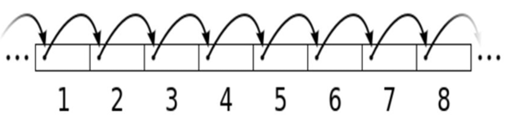
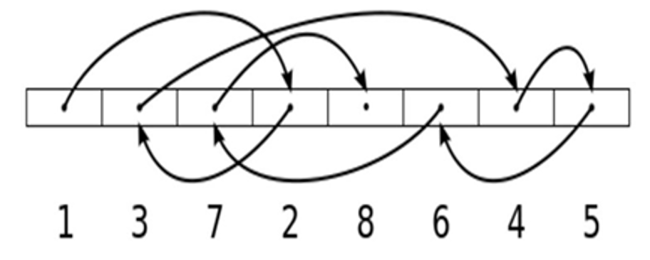
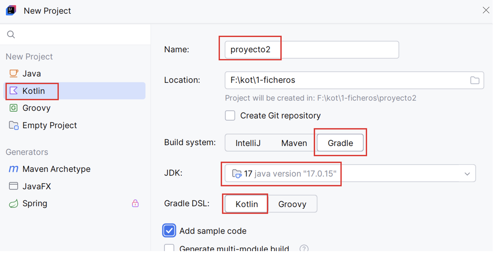

# UD2 — Persistencia en Ficheros

!!! abstract "Resultado de Aprendizaje"
    **RA1** — Desarrolla aplicaciones que gestionan información almacenada en ficheros, identificando el campo de aplicación de los mismos y utilizando clases específicas.

## Objetivos de la Unidad

| # | Objetivo |
| :---: | :--- |
| 1 | Identificar los tipos de ficheros y sus características (texto, binario, intercambio) |
| 2 | Gestionar ficheros y directorios con la API `java.nio` de Kotlin |
| 3 | Leer y escribir ficheros de texto usando buffers y flujos de datos |
| 4 | Trabajar con ficheros de intercambio: CSV, JSON y XML |
| 5 | Implementar el acceso aleatorio a ficheros binarios con registros de tamaño fijo |

---

## Guía de Uso

Estos apuntes están diseñados para que aprendas haciendo. A lo largo de la unidad aplicarás los conceptos teóricos para construir, paso a paso, una aplicación completa de gestión de datos. El tema de la aplicación lo eliges tú, pero los pasos serán los mismos para todos.

!!! success "🔍 Ejecutar y Analizar"
    Contienen fragmentos de código que deben ser ejecutados y comprendidos en detalle. Tu tarea es ejecutar ese código, observar la salida y asegurarte de entender cómo y por qué funciona.

!!! warning "🎯 Práctica para Aplicar"
    Prácticas que debes realizar tú. Es el momento de programar y aplicar lo aprendido. Cada práctica es un bloque que amplía las anteriores, avanzando en tu proyecto final.

!!! danger "📁 Entrega"
    Marcan los puntos de entrega del trabajo. Las entregas pueden ser parciales (el profesor dará sugerencias de mejora) o finales (serán calificadas). No todas las prácticas llevan asociada una entrega.

---

## 1. Introducción

Un **fichero o archivo** es una unidad de almacenamiento de datos en un sistema informático. Es un conjunto de información (secuencia de bytes) organizada y almacenada en un dispositivo de almacenamiento (disco duro, memoria USB o un servidor en la nube). Los datos guardados en ficheros persisten más allá de la ejecución de la aplicación que los trata. La utilización de ficheros es una alternativa sencilla y eficiente a las bases de datos.

### Características de un fichero

* **Nombre**: Cada fichero tiene un nombre único dentro de su directorio.
* **Extensión**: Indica su tipo (.txt para texto, .jpg para imágenes, etc).
* **Ubicación**: Directorios (carpetas) dentro del sistema de ficheros.
* **Contenido**: Texto, imágenes, vídeos, código fuente, bases de datos, etc.
* **Permisos de acceso**: Se pueden configurar para permitir o restringir la lectura, escritura o ejecución a determinados usuarios o programas.

### Tipos de ficheros

* **De texto**: Formato legible por humanos (.txt, .csv, .json, .xml).
* **Binarios**: Formato no legible directamente (.exe, .jpg, .mp3, .dat).
* **De código fuente**: Contienen instrucciones escritas en lenguajes de programación (.java, .kt, .py).
* **De configuración**: Almacenan parámetros de configuración de programas (.ini, .conf, .properties, .json).
* **De bases de datos**: Se utilizan para almacenar grandes volúmenes de datos estructurados (.db, .sql).
* **Historial**: de eventos o errores en un sistema (.log).

### API para manejo de ficheros

**Java.nio** (New IO) es una API disponible desde la versión 7 de Java que permite mejorar el rendimiento, así como simplificar el manejo de muchas operaciones. Funciona a través de interfaces y clases para que la máquina virtual Java tenga acceso a ficheros, atributos de ficheros y sistemas de ficheros. En los siguientes apartados veremos cómo trabajar con ella.

### Formas de acceso

El acceso a ficheros es una tarea fundamental en la programación, ya que permite leer y escribir datos persistentes. Hemos visto que hay diferentes tipos de ficheros, según sus características y necesidades existen dos formas principales de acceder a un fichero (secuencial y aleatorio):

* **Acceso secuencial**: Los datos se procesan en orden, desde el principio hasta el final del fichero. Es el más común y sencillo. Se usa cuando se desea leer todo el contenido o recorrer registro por registro. Por ejemplo lectura de un fichero de texto línea por línea, o de un fichero binario estructurado registro a registro.

* **Acceso aleatorio**: Permite saltar a una posición concreta del fichero sin necesidad de leer lo anterior. Es útil cuando los registros tienen un tamaño fijo y se necesita eficiencia (por ejemplo, ir directamente al registro 100). Requiere técnicas más avanzadas como el uso de `FileChannel`, `SeekableByteChannel` o `RandomAccessFile`.

A lo largo de esta unidad se explicarán algunas funciones de manejo de ficheros que requieren librerías externas (dependencias). Utilizaremos **Gradle** para descargarlas automáticamente en nuestros proyectos.

Para crear un proyecto Kotlin con Gradle en IntelliJ haremos clic en **New Project**, indicamos la información de la siguiente imagen, haremos clic en el botón **Create** y esperaremos a que IntelliJ prepare el proyecto.

A medida que necesitemos utilizar dependencias en nuestro proyecto, las iremos añadiendo al fichero **build.gradle.kts** en la sección de dependencias. Si después de añadirlas no se descargan automáticamente, abrir la **ventana Gradle** (lateral derecho de IntelliJ) y hacer clic en el botón de actualizar.

---

## 🎯 Práctica 1: Proyecto Kotlin con Gradle

!!! warning "🎯 Práctica 1: Proyecto Kotlin con Gradle"
    En esta práctica crearás el proyecto que irás ampliando a lo largo de toda la unidad.

    - **Piensa** en una aplicación de gestión orientada al sector que prefieras y busca un nombre original (será el nombre de tu proyecto).
    - **Crea** un nuevo proyecto con Gradle y comprueba que se ejecuta correctamente (puedes utilizar el código de ejemplo de IntelliJ).

---
