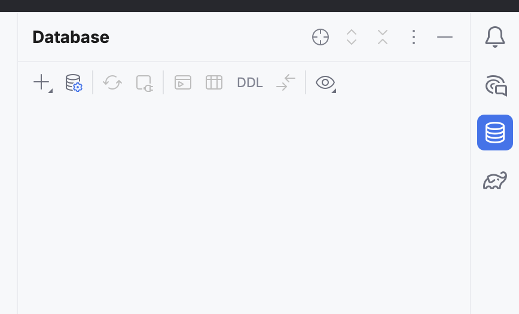
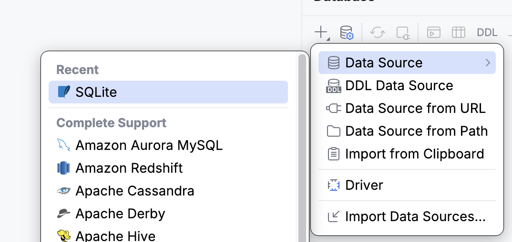
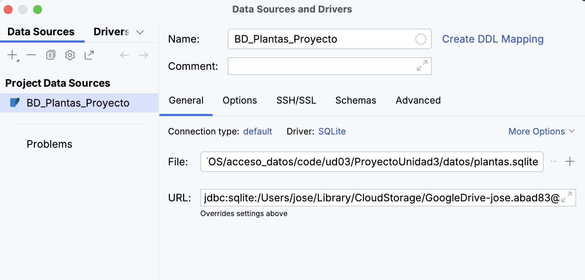
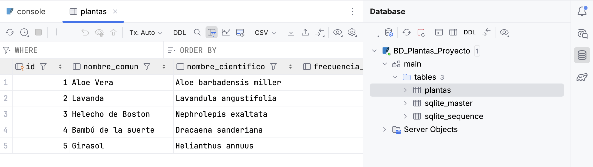

# UD3 - Persistencia en Bases de Datos Relacionales


## Guía de Uso

Estos apuntes están diseñados para un aprendizaje práctico. A lo largo de la unidad se aplicarán los conceptos teóricos para construir, paso a paso, una aplicación completa de gestión de datos. La temática de la aplicación es de libre elección, pero la estructura y los pasos a seguir serán comunes.

Intercaladas con la teoría y los ejemplos, se utilizarán las siguientes cajas de contenido:

* 🔍 **Ejecutar y Analizar**: Contienen fragmentos de código que deben ser ejecutados y comprendidos en detalle. El objetivo es observar su funcionamiento y salida.
* 🎯 **Práctica para Aplicar**: Indican la necesidad de programar y aplicar los conceptos aprendidos para avanzar en el desarrollo del proyecto personal.
* 📁 **Entrega**: Marcan los puntos de entrega del trabajo, que serán revisados y calificados por el profesor.

---

## Fundamentos de las Bases de Datos Relacionaes

En esta primera sección, sentaremos las bases teóricas sobre las bases de datos relacionales y prepararemos el entorno de trabajo inicial para nuestro proyecto.

### Introducción a las Bases de Datos Relacionales

Las bases de datos relacionales son esenciales en el desarrollo de aplicaciones modernas. Su integración con una aplicación requiere realizar una  **conexión** al sistema gestor de base de datos (SGBD) desde el lenguaje de programación.

Este tema se centra en cómo realizar esa conexión, cómo trabajar con datos mediante sentencias SQL y cómo aplicar buenas prácticas, como el cierre de recursos, el uso de transacciones y procedimientos almacenados.

Una **base de datos relacional** es un sistema de almacenamiento de información que **organiza los datos en tablas**. Cada tabla representa una entidad (por ejemplo, clientes, productos, facturas) y está compuestas por filas y columnas, donde cada fila representa un registro único y cada columna contiene un atributo específico de ese registro.

Ejemplo de tabla `clientes`:

| id_cliente | nombre   | ciudad     |
|------------|----------|------------|
| 1          | Pol      | Castellón  |
| 2          | Eli      | Valencia   |

La integridad y las relaciones entre tablas se gestionan mediante claves:

* **Clave Primaria (Primary Key, PK)**: Una o más columnas que identifican de forma única cada registro de una tabla.
* **Clave Foránea (Foreign Key, FK)**: Una columna que referencia la clave primaria de otra tabla, estableciendo así una relación entre ambas.

Ejemplo de tabla `facturas`:

| id_factura | id_cliente | fecha     |
|------------|------------|------------|
| 1          | 1          | 2025-09-18  |
| 2          | 1          | 2025-09-18   |

La interacción con estas bases de datos se realiza a través del lenguaje **SQL (Structured Query Language)**, que permite ejecutar las operaciones **CRUD**:

* **C**reate (Crear): `INSERT`.
* **R**ead (Leer): `SELECT`.
* **U**pdate (Actualizar): `UPDATE`.
* **D**elete (Borrar): `DELETE`.

Un ejemplo sencillo de consulta podría ser:

```sql
    SELECT nombre FROM clientes WHERE ciudad = 'Valencia';
```

Las bases de datos relacionales constituyen un pilar fundamental en el desarrollo de software. Organizan la información en **tablas**, compuestas por filas (registros) y columnas (atributos). Cada tabla representa una entidad (p. ej., `Clientes`, `Productos`).

### Tipos de Gestores de Bases de Datos (SGBD)

Para conectar una aplicación a una base de datos, es esencial conocer el tipo de SGBD, ya que cada uno requiere un conector (driver) específico.

1. **Gestores Embebidos (SQLite, H2, Derby)**:
    * Bases de datos ligeras almacenadas en un único fichero local. No requieren un servicio de servidor independiente.
    * Ideales para aplicaciones de escritorio, móviles, prototipos o pruebas.

2. **Gestores Cliente-Servidor (PostgreSQL, MySQL, Oracle)**:
    * Sistemas robustos que se ejecutan como un servicio en un servidor, permitiendo múltiples conexiones concurrentes.
    * Son el estándar en entornos empresariales y aplicaciones web por su escalabilidad y seguridad.

## Preparación del Entorno

En este proyecto se comenzará usando un **Gestor Embebido** de Bases de Datos, en concreto **SQLite**, por su simplicidad. Antes de comenzar, debes seguir las **instrucciones de Integración de SQLite en IntelliJ**.

### Introducción

Para facilitar el desarrollo y la depuración de nuestra aplicación, es muy útil poder ver y manipular la base de datos directamente desde nuestro entorno de desarrollo (IDE). IntelliJ IDEA incluye una potente herramienta que nos permite conectar con nuestro fichero `plantas.sqlite`, ver sus tablas, ejecutar consultas SQL y mucho más, sin tener que salir del editor de código.

Esta guía te mostrará cómo configurar esta conexión paso a paso.

**Requisitos:**

* Tener tu proyecto de Kotlin abierto en IntelliJ IDEA.
* Haber creado el fichero `.sqlite` (ej: `plantas.sqlite`) y tenerlo ubicado dentro de la carpeta `datos` de tu proyecto.

**Descarga tu base de datos:**

* Para trabajar en esta unidad, primero debes descargar el fichero [plantas.sqlite](../../assets/resources/plantas.sqlite)

> **NOTA IMPORTANTE:** Para hacer uso de esta funcionalidad de IntelliJ, tienes que tener activada la versión **Ultimate de IntelliJ**.
>
> Como estudiante, puedes activarla gratis. Para ello date de alta y [sigue la guía desde este enlace](https://www.jetbrains.com/es-es/academy/student-pack/).

---

### Paso 1: Abrir la Herramienta de Base de Datos

En el lateral derecho de la ventana de IntelliJ, busca y haz clic en la pestaña vertical **Database**. Si no la encuentras, puedes abrirla desde el menú superior: `View > Tool Windows > Database`.



### Paso 2: Añadir una Nueva Conexión (Data Source)

Dentro de la ventana "Database", haz clic en el icono del signo más (`+`) y en el menú desplegable selecciona `Data Source > SQLite`.



### Paso 3: Configurar la Conexión al Fichero

Se abrirá una ventana de configuración llamada "Data Sources and Drivers". Aquí debemos indicar a IntelliJ dónde se encuentra nuestro fichero de base de datos.

1. **Nombre (Name):** Asígnale un nombre descriptivo a tu conexión, por ejemplo: `BD_Plantas_Proyecto`.
2. **Fichero (File):** Este es el paso clave. Haz clic en el botón con los tres puntos (`...`) para abrir el explorador de archivos. Navega hasta la carpeta raíz de tu proyecto, entra en el directorio `datos` y selecciona tu fichero (`plantas.sqlite`).
3. **Descargar Drivers:** Si es la primera vez que usas esta función, IntelliJ te notificará que faltan los drivers necesarios para comunicarse con SQLite. Verás un texto de advertencia con un enlace azul: `Download missing driver files`. Haz clic en él. IntelliJ los descargará e instalará automáticamente en segundo plano.

La ventana de configuración debería tener un aspecto similar a este:



### Paso 4: Probar la Conexión y Finalizar

Antes de guardar, es fundamental verificar que la configuración es correcta.

1. Haz clic en el botón **Test Connection** en la parte inferior de la ventana.
2. Si todo está bien configurado, verás un mensaje de éxito con un tick verde: `Succeeded`.
3. Una vez confirmada la conexión, haz clic en **Apply** y luego en **OK** para cerrar la ventana.

### Paso 5: Explora tu Base de Datos

Ya has conectado tu base de datos al IDE. En la pestaña "Database" ahora verás tu nueva conexión. Si la despliegas (`>`):

* Podrás ver los esquemas de la base de datos (en SQLite, normalmente solo `main`).
* Dentro del esquema, encontrarás tu tabla `plantas` (o la que hayas creado).
* Si despliegas la tabla, verás todas sus columnas con sus tipos de datos.

Si haces **doble clic sobre el nombre de la tabla** (`plantas`), se abrirá un visor de datos interactivo. Desde aquí podrás ver los registros, ordenarlos, e incluso añadir, modificar o eliminar filas directamente como si fuera una hoja de cálculo.



### ¿Qué más puedes hacer ahora?

* **Ejecutar Consultas SQL:** Haz clic derecho sobre el nombre de tu conexión y selecciona `New > Query Console`. Se abrirá un editor donde podrás escribir y lanzar sentencias SQL (`SELECT`, `INSERT`, etc.) y ver los resultados al instante.
* **Visualizar el Esquema:** Haz clic derecho sobre tu tabla y selecciona `Diagrams > Show Visualization...` para ver un diagrama entidad-relación de tu base de datos.

Esta integración es una herramienta muy potente para comprobar en tiempo real que las operaciones de tu DAO en Kotlin están funcionando como esperas.

## 🎯 **Práctica 1. Creación del Proyecto y la Base de Datos**

1. Crea un nuevo proyecto en Kotlin con Gradle.
2. A partir de la información anterior, utiliza la herramienta de **SQLite en IntelliJ** para crear un fichero `nombre_de_tu_BD.sqlite`.
3. Siguiendo con los **datos definidos en la Unidad Anterior** crea una tabla en tu nueva Base de Datos. Se debe definir con una clave primaria y los tipos de datos adecuados para cada columna.
4. Recuerda crear una carpeta `datos` en la raíz de tu proyecto y almacenar en ella el archivo `.sqlite`.
5. Realiza distintas operaciones `CRUD`sobre la Base de Datos `SELECT, INSERT, UPDATE y DELETE`sobre la tabla definida para probar su funcionamiento. Puedes usar la misma herramienta de **IntelliJ**.
