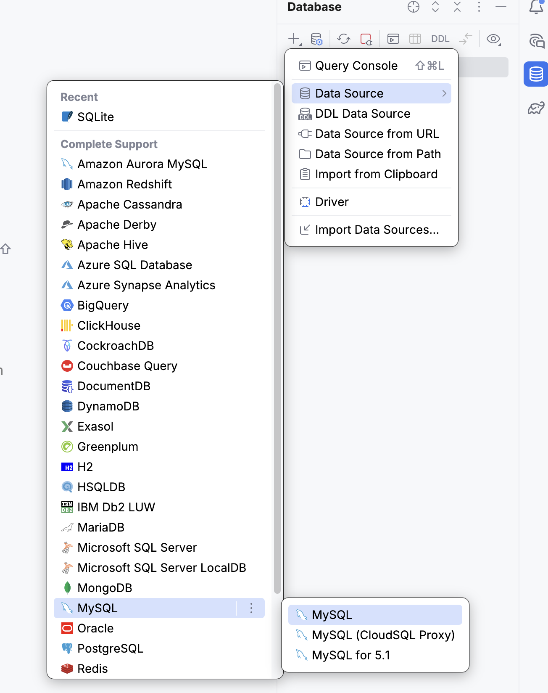
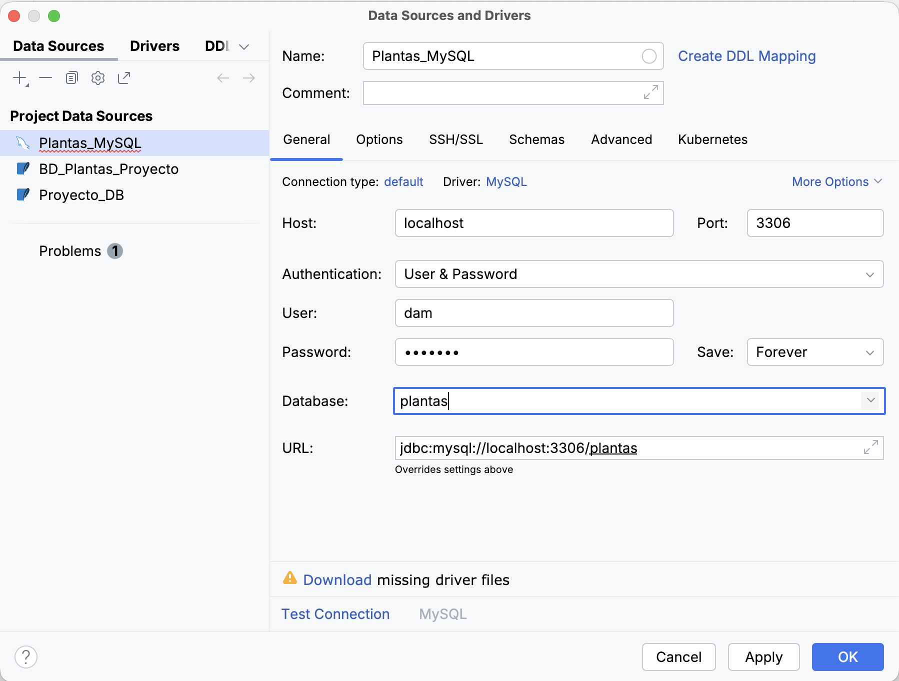
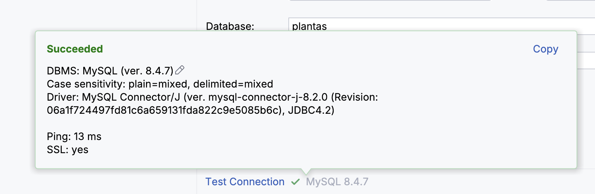
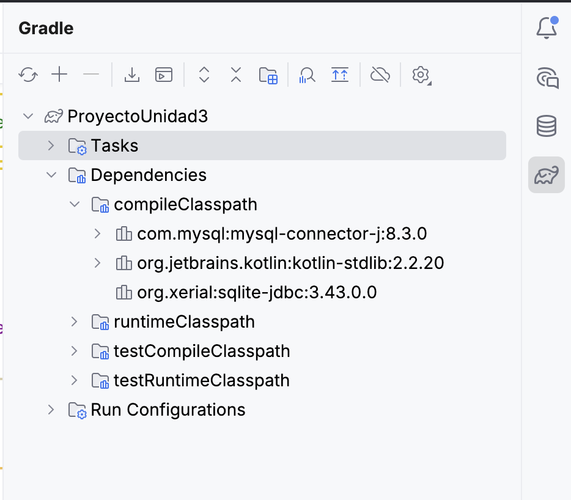

# Evolución a SGBD Cliente-Servidor

Gracias a la buena arquitectura, migrar de SQLite a PostgreSQL, MySQL o cualquier **Sistema Gestor de Bases de Datos** (SGBD) es sencillo. Solo requiere modificar el gestor de conexión.

## Preparación del Entorno. MySQL desde IntelliJ

Para el siguiente paso vamos a configurar y probar una conexión con el **SGBD MySQL**. Instalado en una máquina local. Los pasos a seguir son muy parecidos a los realizamos en la [sección de Preparación del Entorno en la Introducción, con **SQLite**](introduccion.md).

En el lateral derecho de la ventana de IntelliJ, busca y haz clic en la pestaña vertical **Database**. Si no la encuentras, puedes abrirla desde el menú superior: `View > Tool Windows > Database`.

Dentro de la ventana "Database", haz clic en el icono del signo más (`+`) y en el menú desplegable selecciona `Data Source > MySQL`.



Se abrirá una ventana de configuración llamada "Data Sources and Drivers". Aquí debemos indicar a IntelliJ dónde se encuentra nuestro fichero de base de datos.

1. **Nombre (Name):** Asígnale un nombre descriptivo a tu conexión, por ejemplo: `Plantas_MySQL`.
2. **Host:** En este paso debemos indicar la dirección **IP o la URL** donde está alojado nuestro SGBD MySQL. En nuestro caso, `localhost`.
3. **Authentication (User & Password):** Indicaremos las **Credenciales** de acceso a nuestra Base de Datos.
4. **Database:** Debemos escribir el numbre de nuestra Base de Datos.
5. **Descargar Drivers:** Si es la primera vez que usas esta función, IntelliJ te notificará que faltan los drivers necesarios para comunicarse con SQLite. Verás un texto de advertencia con un enlace azul: `Download missing driver files`. Haz clic en él. IntelliJ los descargará e instalará automáticamente en segundo plano.

    La ventana de configuración debería tener un aspecto similar a este:

    

6. Comprobamos que tenemos una conexión abierta y funcionando.

    

## Migración de la BD

Ahora que tenemos configurado el entorno, podemos realizar una importación del **esquema de nuestra base de datos**. Para ello, desde la herramienta, podemos abrirnos una consola SQL (o la herramienta gráfica de creación) e ir añadiendo todas las tablas de nuestra base de datos.

!!! warning "Cuidado"
    El esquema de datos debe ser el mismo que hemos usado, es decir, los mismos **campos** y **tipos de datos.** En la sección de *transacciones* de la unidad, hemos añadido más tablas a nuestro esquema de Base de Datos.

```sql
CREATE TABLE plantas (
    id INTEGER PRIMARY KEY AUTO_INCREMENT,
    nombre_comun VARCHAR(100),
    nombre_cientifico VARCHAR(100),
    frecuencia_riego INTEGER,
    altura  REAL,
    stock INTEGER
);

/* CREAMOS EL ESQUEMA DE TODAS LAS TABLAS COMO LAS TENÍAMOS EN SQLITE */
```

## Modificación del Conector

Como decíamos al inicio, gracias a la **modularidad** que nos ofrece la **arquitectura** de nuestro Proyecto, para poder cambiar el **SGBD** simplemente tendremos que cambiar el archivo `ConexionDB` e indicarle que nuestra conexión se realizará contra *MySQL*.

El primer paso que debemos hacer es **añadir las dependencias** adecuadas a nuestro `build.gradle.kts`.

```kotlin
dependencies {
    testImplementation(kotlin("test"))
    // Para SQLite
    implementation("org.xerial:sqlite-jdbc:3.43.0.0")

    // Para MySQL
    implementation("mysql:mysql-connector-java:8.3.0") //MySQL
}
```

!!! warning "Importante"
    Si observas que no funciona, prueba a *recargar las dependencias* del Proyecto desde las herramientas de Gradle.



El paso final es modificar el archivo `ConexionBD.kt` de nuestro proyecto. Buscamos la configuració que teníamos con **SQLite** y añadimos la nueva conexión con **MySQL**.

```kotlin

    // Cambia los valores según tu configuración MySQL
    private const val HOST = "localhost" // La IP o dominio de tu SGBD
    private const val PORT = 3306
    private const val DATABASE = "plantas" 
    private const val USER = "USER" // Cambialo por tu usuario
    private const val PASSWORD = "PASSWORD" // Cambialo por tu contraseña

    // URL JDBC para MySQL
    private val url = "jdbc:mysql://$HOST:$PORT/$DATABASE?useSSL=false&serverTimezone=Europe/Madrid"

    fun getConnection(): Connection? {
        return try {
            DriverManager.getConnection(url, USER, PASSWORD)
        } catch (e: SQLException) {
            println("Error al conectar con la base de datos MySQL: ${e.message}")
            null
        }
    }
    // Función de prueba: verificar conexión
    fun testConnection(): Boolean {
        return getConnection()?.use { conn ->
            println("Conexión establecida con éxito")
            true
        } ?: false
    }
```

## 🎯 **Práctica 6: Migración a Mysql o PostgreSQL**

1. Instala MySQL o PostgreSQL, preferiblemente mediante un contenedor Docker, AWS o VirtualBox.
2. Migra la base de datos que has creado y la/s tabla/s en el nuevo SGBD con la misma estructura.
3. Modifica `ConexionBD.kt` con los nuevos parámetros de conexión (URL, usuario, contraseña).
4. Ejecuta la aplicación. Debería funcionar sin alterar el DAO o la lógica principal.
