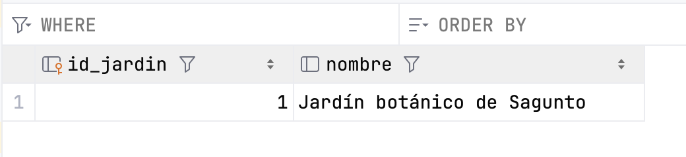
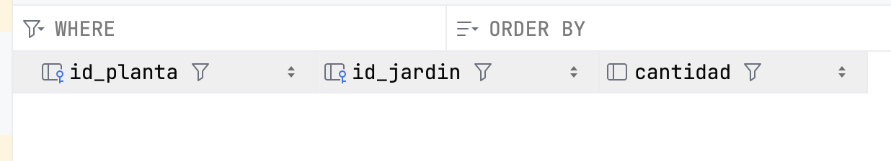

# Transacciones

## Gestión de Transacciones

Una transacción es una secuencia de una o más operaciones sobre una base de datos que deben ejecutarse como una unidad indivisible. El objetivo es asegurar que todas las operaciones se completen con éxito o, en caso de fallo, ninguna de ellas se aplique, manteniendo así la base de datos en un estado consistente.

> Por ejemplo, en una transferencia bancaria, si falla el abono en una cuenta, se cancela el débito en la otra.

Las transacciones se gestionan mediante comandos como `BEGIN TRANSACTION` (para iniciar), `COMMIT` (para confirmar los cambios) y `ROLLBACK` (para deshacer los cambios en caso de error). Este mecanismo protege la base de datos frente a fallos parciales y situaciones de concurrencia, asegurando que los datos siempre reflejen una realidad válida y coherente.

### Propiedades de una transacción (ACID)

Las transacciones garantizan propiedades fundamentales, conocidas por el acrónimo ACID:

Propiedad|Significado breve
---------|-------------------
Atomicidad|Todas las operaciones se ejecutan o ninguna lo hace
Consistencia|El sistema pasa de un estado válido a otro
Isolación|No interfiere con otras transacciones simultáneas
Durabilidad| Una vez confirmada, el cambio permanece

### Comandos clave

Para controlar correctamente una transacción desde el código, necesitamos usar tres comandos clave:

- **commit()**: Confirma los cambios realizados por la transacción, haciéndolos permanentes.
- **rollback()**: Revierte todos los cambios realizados durante la transacción actual, volviendo al estado anterior.

Por defecto, muchas conexiones JDBC están en modo **auto-commit**, es decir, cada operación se ejecuta y confirma automáticamente. Para usar transacciones de forma manual, debes desactivar este modo:

```kotlin
conexion.autoCommit = false
```

### Excepciones

El manejo de excepciones en las transacciones es absolutamente necesario para garantizar que los datos de la base de datos no queden en un estado inconsistente o corrupto cuando ocurre un error durante una operación.

Una transacción sin control de errores no es una transacción segura. Siempre hay que estar preparado para deshacer todo si algo sale mal.

Cuando realizamos varias operaciones dentro de una misma transacción (por ejemplo, una transferencia bancaria), pueden ocurrir errores como:

- un fallo de conexión,
- un ID incorrecto,
- un valor nulo inesperado,
- un error lógico como saldo insuficiente.
  
Si no controlamos esos errores, la base de datos podría:

- Aplicar solo algunas de las operaciones
- Dejar datos parcialmente modificados
- Generar resultados incorrectos para otros usuarios

Para evitarlo se utiliza un bloque **try-catch** que:

- Llama a commit() si todo sale bien
- Llama a rollback() si ocurre cualquier excepción

``` kotlin
        try {
            conexion.autoCommit = false

            // Varias operaciones SQL...
            conexion.commit()  // Todo bien
        } catch (e: Exception) {
            conexion.rollback()  // Algo falló → revertir
            println("Error en la transacción. Cambios anulados.")
        }
```

!!! success "🔍 **Ejecutar y Analizar: Implementación de una Transacción**"
    Prueba el código de ejemplo y verifica que funciona correctamente.

Este método de ejemplo actualiza dos registros de forma segura dentro de una transacción.

```kotlin
import java.sql.Connection

fun actualizarAlturasConTransaccion(id1: Int, nuevaAltura1: Double, id2: Int, nuevaAltura2: Double) {
    var conn: Connection? = null
    try {
        conn = ConexionBD.getConnection()
        conn?.autoCommit = false // 1. Iniciar transacción

        conn?.prepareStatement("UPDATE plantas SET altura = ? WHERE id = ?")?.use { stmt ->
            stmt.setDouble(1, nuevaAltura1); 
            stmt.setInt(2, id1); 
            stmt.executeUpdate()
        }
        conn?.prepareStatement("UPDATE plantas SET altura = ? WHERE id = ?")?.use { stmt ->
            stmt.setDouble(1, nuevaAltura2); 
            stmt.setInt(2, id2); 
            stmt.executeUpdate()
        }

        conn?.commit() // 2. Confirmar cambios
        println("Transacción completada.")
    } catch (e: SQLException) {
        println("Error en la transacción, se revierten los cambios: ${e.message}")
        conn?.rollback() // 3. Revertir cambios
    } finally {
        conn?.autoCommit = true
        conn?.close()
    }
}
```

### Ejemplo con varias tablas

Vamos a modificar la `BD_plantas`. Para el siguiente ejemplo se han añadido a la BD las tablas `jardines`y `jardines_plantas` cuya estructura es la siguiente:

```sql
/* Añadimos una columna de 'stock' a la tabla 'plantas' */
ALTER TABLE plantas ADD COLUMN stock INTEGER;
/* Actualizamos y ponemos a 50 todo el stock */
UPDATE plantas SET stock = 50 WHERE 1;

/* Creación de la tabla jardines */
CREATE TABLE jardines (
    id_jardin INTEGER PRIMARY KEY AUTOINCREMENT,
    nombre TEXT
);
/* Inserción de un jardín */
INSERT INTO jardines(nombre) VALUES ('Jardín botánico de Sagunto');

/* Creación de la relación 'jardines_plantas' */
CREATE TABLE jardines_plantas (
    id_planta INTEGER,
    id_jardin INTEGER,
    cantidad INTEGER,
    FOREIGN KEY (id_planta) REFERENCES plantas (id),
    FOREIGN KEY (id_jardin) REFERENCES jardines (id_jardin)
);
```





Supongamos que queremos llevar varias unidades de una planta a un jardín. El programa debe actualizar el stock en la tabla `plantas` (restando las unidades correspondientes) y añadir un registro en la tabla `jardines_plantas` indicando el jadín, la planta y la cantidad.

Ambas operaciones deben realizarse juntas, o no realizarse ninguna. El código sería el siguiente:

``` kotlin
fun llevarPlantasAJardin(id_jardin: Int, id_planta: Int, cantidad: Int) {
    var conn: Connection? = null
    try {
        conn = ConexionBD.getConnection()
        conn?.autoCommit = false  // Iniciar transacción manual

        // Restar stock a la planta
        conn?.prepareStatement("UPDATE plantas SET stock = stock - ? WHERE id = ?").use { stmt ->
            stmt?.setInt(1, cantidad);
            stmt?.setInt(2, id_planta);
            stmt?.executeUpdate()
        }

        // Añadir línea en tabla jardines_plantas
        conn?.prepareStatement("INSERT INTO jardines_plantas(id_jardin, id_planta, cantidad) VALUES (?, ?, ?)")
            .use { stmt ->
                stmt?.setInt(1, id_jardin);
                stmt?.setInt(2, id_planta);
                stmt?.setInt(3, cantidad);
                stmt?.executeUpdate()
            }

        // Confirmar cambios
        conn?.commit()
        println("Transacción realizada con éxito.")
    } catch (e: SQLException) {
        if (e.message?.contains("UNIQUE constraint failed") == true) {
            println("Intento de insertar clave duplicada")
            conn?.rollback()
            println("Transacción revertida.")
        } else {
            throw e // otros errores, relanzamos
        }
    } finally {
        // Código que se ejecuta siempre
        println("Fin del programa.")
    }
}
```

Si no se produce ningún error se hará el `commit` y en caso contrario el `rollback`

!!! success "🔍 **Ejecutar y Analizar: Transacciones con varias tablas**"
    Prueba el código de ejemplo y verifica que funciona correctamente.
    Ten en cuenta que tendrás que crear una función `main`que haga las llamadas correctas a las funciones   `llevarPlantasAJardin` y `actualizarAlturasConTransaccion`.

```kotlin
// Por ejemplo
fun main() {
    actualizarAlturasConTransaccion(1, 0.9, 3, 0.95)
    llevarPlantasAJardin(1,1,10)
}
```

## 🎯 **Práctica 5: Transacciones**

1. Diseña un bloque de transacciones de actualización para tu proyecto.
2. La operación de transacción debe incluir varios `UPDATE`, `INSERT` o `DELETE`, que afecten a **varios registros que cumplan ciertas condiciones**.
3. Si lo deseas, puedes comenzar a **añadir nuevas tablas** en la BD de tu Proyecto.