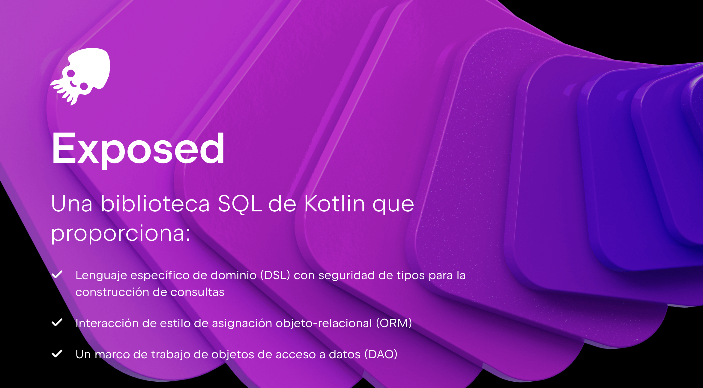

# UD4 — Mapeo Objeto Relacional (ORM)

!!! abstract "Resultado de Aprendizaje"
    **RA3** — Gestiona la persistencia de los datos mediante herramientas de mapeo objeto-relacional (ORM), desarrollando aplicaciones que la utilizan.

## Objetivos de la Unidad

| # | Objetivo |
| :---: | :--- |
| 1 | Comprender qué es un ORM y las ventajas de Kotlin Exposed frente a JDBC puro |
| 2 | Configurar Exposed en un proyecto Kotlin con Gradle |
| 3 | Definir esquemas de base de datos mediante clases Kotlin (`Table`, `IntIdTable`) |
| 4 | Ejecutar operaciones CRUD utilizando el DSL y el DAO de Exposed |
| 5 | Realizar consultas avanzadas, filtros y joins con Exposed |

---

## Guía de Uso

Estos apuntes están diseñados para un aprendizaje práctico. A lo largo de la unidad se aplicarán los conceptos teóricos para construir, paso a paso, una aplicación completa de gestión de datos.

La temática de la aplicación es de libre elección, pero la estructura y los pasos a seguir serán comunes. Intercaladas con la teoría y los ejemplos, se utilizarán las siguientes cajas de contenido:

!!! success "🔍 Ejecutar y Analizar"
    Contienen fragmentos de código que deben ser ejecutados y comprendidos en detalle. El objetivo es observar su funcionamiento y salida.

!!! warning "🎯 Práctica para Aplicar"
    Indican la necesidad de programar y aplicar los conceptos aprendidos para avanzar en el desarrollo del proyecto personal.

!!! danger "📁 Entrega"
    Marcan los puntos de entrega del trabajo, que serán revisados y calificados por el profesor.

## Instalación y Configuración del Entorno

En esta parte, abordaremos los dos primeros Criterios de Evaluación (CE a y CE b): la instalación de Kotlin Exposed y la configuración de la conexión a la base de datos (BD).

### 1. Introducción: ORM ¿Por qué Exposed?

Antes de empezar, es importante entender por qué usamos un ORM.

Un **ORM (Object-Relational Mapping)** actúa como un traductor entre el mundo de los objetos de Kotlin (clases, instancias) y el mundo de las tablas de la base de datos (filas, columnas). **Exposed** es un ORM ligero y puramente Kotlin, lo que lo hace muy idiomático y fácil de integrar.

**Kotlin Exposed** nos aporta varias ventajas clave:

* **Persistencia Transparente (CRUD):** En lugar de escribir sentencias SQL manuales (`INSERT INTO...`), interactuamos con objetos y el ORM se encarga de generar y ejecutar el SQL por debajo.
* **Manejo del Esquema (DDL):** Permite definir la estructura de las tablas usando clases de Kotlin (`object Usuarios : Table`), lo cual es mucho más natural. Ejemplo: `SchemaUtils.create(Usuarios)` genera la sentencia `CREATE TABLE...`.
* **Abstracción de la Base de Datos:** Los comandos son universales. Si decidimos cambiar de base de datos (ej: de MySQL a PostgreSQL), nuestro código Exposed (el DSL de consultas) **no necesita ser modificado**.
* **Seguridad:** El *Domain Specific Language (DSL)* de Exposed maneja los parámetros de las consultas de forma segura, previniendo inyecciones SQL.

Nuestro objetivo: Escribir código Kotlin en lugar de sentencias SQL crudas, delegando la gestión de la BD al ORM. La [página oficial de Exposed la tienes aquí](https://www.jetbrains.com/es-es/exposed/).



### 2. Instalación de Dependencias

El primer paso es añadir la librería Exposed y el driver JDBC necesario en nuestro fichero `build.gradle.kts`.

Necesitamos tres componentes de Exposed y el driver de **MariaDB** (MySQL), ya que es el que usamos por coherencia con la unidad anterior.

!!! success "🔍 Ejecutar y Analizar"
    Abre tu archivo `build.gradle.kts` y asegúrate de que las dependencias de Exposed y MariaDB estén presentes. Recuerda usar el prefijo `implementation`.

Fichero: `build.gradle.kts`

```kotlin
dependencies {
    
    val exposedVersion = "0.52.0"

    // 1. Exposed Core: Funcionalidad base
    implementation("org.jetbrains.exposed:exposed-core:${exposedVersion}")
    
    // 2. Exposed JDBC: Conexión y ejecución de consultas
    implementation("org.jetbrains.exposed:exposed-jdbc:${exposedVersion}")
    
    // 3. Exposed DAO: Data Access Object
    implementation("org.jetbrains.exposed:exposed-dao:${exposedVersion}")
    
    // 4. Módulo CLAVE para mapear tipos de fecha (LocalDate, etc.)
    implementation("org.jetbrains.exposed:exposed-java-time:${exposedVersion}")
    
    // 5. Driver JDBC MySQL (Necesario para conectar con nuestro servidor MySQL)
    implementation("mysql:mysql-connector-java:8.0.29") //MySQL

    // Dependencia estándar de Kotlin...
    implementation("org.jetbrains.kotlin:kotlin-stdlib-jdk8")

}
```

### 3. Conexión con la BD

Vamos a preparar ahora nuestro **Objeto de conexión a la Base de Datos**.

Como vimos en la anterior unidad, este objeto nos facilitará gestionar la manera en la que nos conectamos con nuestro servidor. En nuestro caso, seguiremos trabajando con *MySQL*.

Aquí tienes el código de nuestro objeto **ConexionDB** (ubicado en `ConexionDB.kt`), con la configuración de la unidad anterior y la integración de Exposed.

```kotlin
import org.jetbrains.exposed.sql.Database
import org.jetbrains.exposed.sql.SchemaUtils
import org.jetbrains.exposed.sql.transactions.transaction
import org.jetbrains.exposed.sql.Table // Importación necesaria para definir la tabla
import java.sql.DriverManager
import java.sql.SQLException
import java.sql.Connection 

object ConexionDB {
    
    // Configuración de la unidad anterior 
    private const val HOST = "IP_HOST"
    private const val PORT = 3306
    private const val DATABASE = "NOMBRE_BD" // Nombre de nuestra BD
    private const val USER = "USUARIO_BD"
    private const val PASSWORD = "PASSWORD_BD"
    
    // URL JDBC para MySQL, ahora utilizada por Exposed
    private val URL = "jdbc:mysql://$HOST:$PORT/$DATABASE?useSSL=false&serverTimezone=Europe/Madrid"

    // Propiedad para almacenar la instancia de la base de datos de Exposed
    lateinit var db: Database // LA INSTANCIA DE LA CONEXIÓN EXPOSED
    
    /**
     * Intenta establecer la conexión con Exposed e inicializa el esquema de la BD.
     * (CE b: Configuración de la herramienta ORM)
     */
    fun conectar() {
        try {
            // 1. Establece la conexión con la base de datos a través de Exposed
            db = Database.connect(
                url = URL, 
                user = USER, 
                password = PASSWORD
            )
            println("Conexión a MySQL establecida con éxito usando Exposed.")
            
        
         
        } catch (e: Exception) {
            println("Error al conectar o inicializar la base de datos: ${e.message}")
            if (e.message?.contains("Communications link failure") == true) {
                println("   Pista: Asegúrate de que el servidor MySQL está activo y las credenciales son correctas.")
            }
        }
    }
    
    /**
     * Función de prueba para verificar la conexión, manteniendo la estructura de la Unidad 3.
     */
    fun testConexion(): Boolean {
        return try {
            DriverManager.getConnection(URL, USER, PASSWORD)?.use { conn ->
                println("Test: Conexión JDBC pura establecida con éxito.")
                true
            } ?: false
        } catch (e: SQLException) {
            println("Test: Error al conectar con JDBC puro: ${e.message}")
            false
        }
    }
}
```

#### Código Explicado: El Corazón de Exposed

Nuestro conector ha cambiado ligeramente respecto a nuestra anterior versión. Vamos a comentar, paso por paso, las *diferencias*.

```kotlin
lateinit var db: Database 
```

##### ¿Qué es `Database`?

* **Propósito:** `Database` es la clase central de Kotlin Exposed. Una instancia de esta clase representa la conexión y la configuración del *pool* de conexiones a tu base de datos relacional (en nuestro caso, MySQL).
* **Función:** Es la puerta de entrada a todas las operaciones ORM. Cualquier `transaction { ... }` que ejecutemos después deberá saber qué `Database` usar.

##### ¿Por qué `lateinit`?

* **Definición:** `lateinit` es una palabra clave de Kotlin que significa "inicialización tardía" (*late initialization*).
* **Necesidad:** La conexión a la base de datos es una operación de E/S que ocurre **después** de que el objeto `ConexionDB` se construye, específicamente dentro de la función `conectar()`.
* **Solución:** Al usar `lateinit`, le decimos al compilador de Kotlin: "Confía en mí, esta variable será inicializada con un valor válido antes de que sea utilizada por primera vez." Esto evita errores de compilación sin forzarnos a declarar la variable como `null` o inicializarla con un valor falso.

##### Uso dentro de Exposed: La Transacción

La variable `db` se utiliza como argumento obligatorio en los bloques transaccionales:

```kotlin
transaction(ConexionDB.db) {
    // Aquí se ejecutan consultas o DDL
}
```

* Al pasar `ConexionDB.db` a la función `transaction()`, aseguramos que Exposed dirija todas las sentencias SQL (INSERT, SELECT, CREATE TABLE) al servidor MySQL que definimos en la `URL`.

## 🎯 **Práctica 1. Creación del Proyecto y la Base de Datos**

Comenzaremos con nuestro proyecto. Como siempre, preparemos el entorno para poder trabajar durante toda la **Unidad 4** con el **ORM Exposed**.

!!! warning "Sigue las instrucciones de la **Práctica 1**"
    1. Crea un nuevo proyecto Kotlin/JVM.
    2. Actualiza el fichero `build.gradle.kts` con las dependencias de Exposed y MariaDB.
    3. Crea el archivo `ConexionDB.kt` (mira el Canvas) y el `MainApp.kt`.
    4. Ejecuta la función `testConexion()` para asegurarte de que tu servidor MySQL está operativo.

