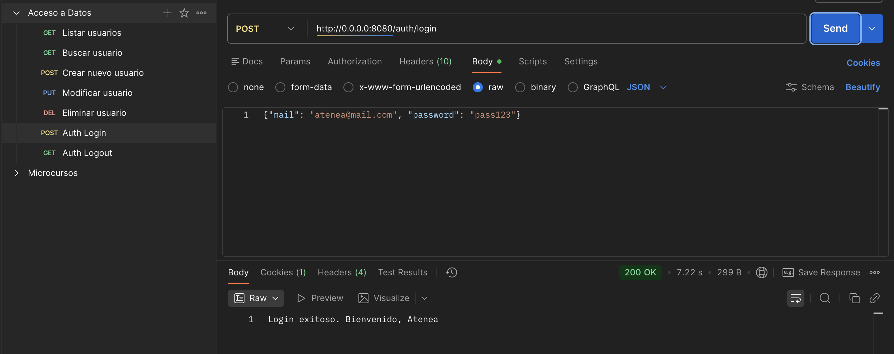
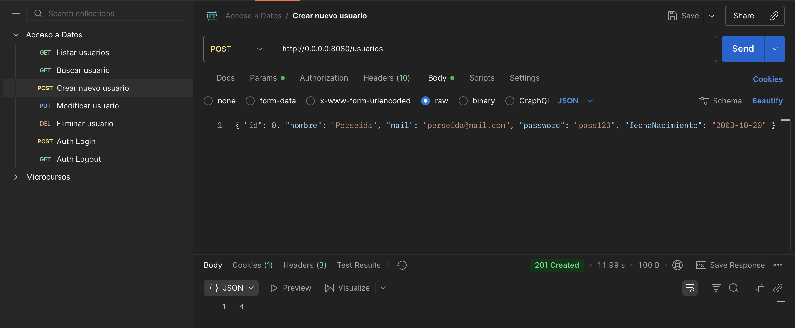
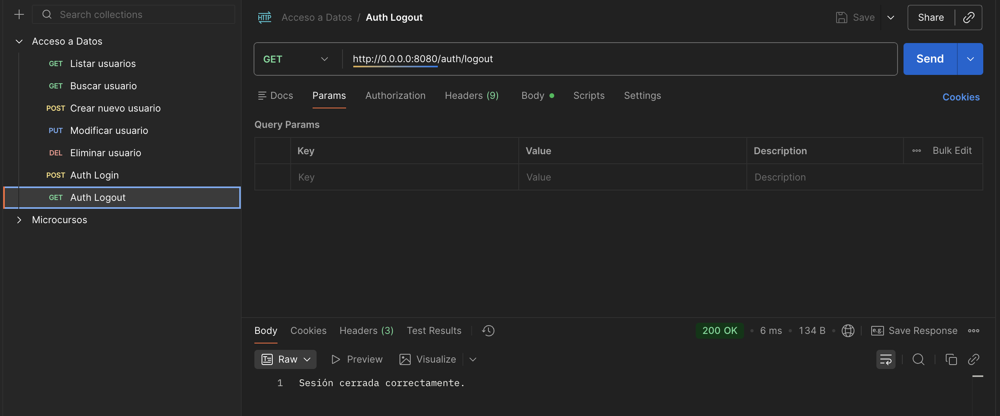
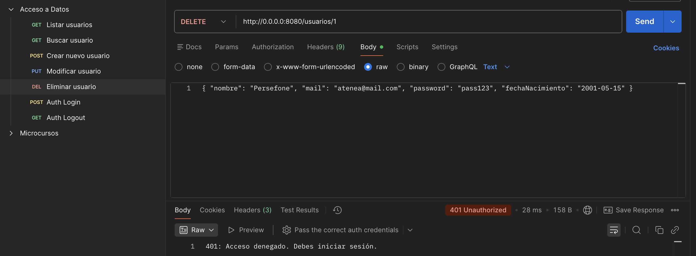

# Autenticación y Sesiones

En este bloque, vamos a dotar a nuestra API de una capa de seguridad profesional. Implementaremos un sistema de **Sesiones** para identificar a los usuarios y restringiremos el acceso a las operaciones sensibles.

## 1 ¿Por qué Sesiones?

### ¿Qué estamos haciendo?

HTTP es un protocolo "sin estado" (*stateless*). Esto significa que el servidor olvida quién eres en cuanto termina la petición. Las **Sesiones** nos permiten guardar un "carnet de identidad" temporal en el navegador del usuario (usando una Cookie) para que el servidor lo reconozca en futuras visitas.

### ¿Para qué sirve?

* **Seguridad:** Permite restringir el acceso a usuarios no identificados.
* **Persistencia:** Mantiene al usuario logueado sin pedirle la contraseña en cada click.

### Configuración del entorno

Antes de empezar, vamos a añadir los módulos de **Seguridad** y **Sesiones** a nuestro gestor de dependencias y activar dichos plugins en el arranque del servidor. Sirve para que Ktor reconozca las herramientas de protección. Sin esta configuración, el servidor no sabrá qué hacer cuando encuentre un bloque `authenticate` y lanzará un error de "Plugin no instalado".

!!! success "🔍 Actualización de `build.gradle.kts`"
    Asegúrate de incluir estos dos módulos esenciales en tu bloque de dependencias:

```kotlin
dependencies {
    // ... otras dependencias ...

    // Módulos de seguridad necesarios
    implementation("io.ktor:ktor-server-auth-jvm:$ktor_version")
    implementation("io.ktor:ktor-server-sessions-jvm:$ktor_version")
}
```

!!! success "🔍 Inicialización en el Módulo Principal"
    Para que el plugin sea detectado, debes llamar a `configureSecurity()` en tu función de módulo (normalmente en `Application.kt` o donde configures el servidor), siempre **antes** de las rutas.

```kotlin
fun Application.module() {
    configureSerialization() // Traducción JSON
    configureSecurity()      // INSTALACIÓN DEL GUARDIÁN (Auth y Sesiones)
    configureRouting()       // Definición de las rutas
}
```

## 2 Actualización de la Capa de Persistencia (DAO)

Necesitamos realizar la expansión de nuestro **Modelo** de datos para permitir búsquedas por campos únicos que no son la clave primaria (en este caso, el email).

Para que el sistema de autenticación pueda localizar a un usuario específico mediante su "nombre de usuario" o correo antes de proceder a verificar su identidad con la contraseña.

!!! success "🔍 Modificación en `data/UsuariosDAO.kt`"

```kotlin
fun seleccionarPorEmail(email: String): UsuarioDTO? = transaction {
    Usuarios.select { Usuarios.mail eq email }
        .map { it.toUsuarioDTO() }
        .singleOrNull()
}
```

## 3 Lógica de Dominio y Autenticación

Es la definición del "carnet de identidad" (`UserSession`) que el servidor entregará al cliente y la lógica de negocio que valida si alguien es quien dice ser.

Tener un objeto de sesión específico en la capa de **Domain** asegura que sea visible desde todo el proyecto (evitando errores de compilación). 

!!! success "🔍 Nuevo Fichero: `domain/UserSession.kt`"

```kotlin
package com.tu.proyecto.domain

import kotlinx.serialization.Serializable

@Serializable
data class UserSession(val email: String)
```

Para el login solo necesitamos email y password. No usar el DTO general de Usuario, porque Ktor fallará al no recibir el resto de campos.

!!! success "🔍 Fichero: `domain/LoginRequest.kt`"

```kotlin
@Serializable
data class LoginRequest(
    val mail: String,
    val password: String
)
```

El **Servicio** centraliza la validación para que el controlador no tenga que manejar contraseñas directamente.

!!! success "🔍 Actualización de `services/UsuariosService.kt`"

```kotlin
/**
 * Valida las credenciales de un usuario.
 */
fun buscarPorEmail(mail: String, pass: String): UsuarioDTO? {
    val usuario = UsuariosDAO.seleccionarPorEmail(mail)
    // Comparamos el email y la contraseña antes de dar el OK
    return if (usuario != null && usuario.password == pass) usuario else null
}
```

---

## 3 Configuración de Seguridad: `plugins/Security.kt`

Vamor ahora a realizar la configuración de los plugins de **Sesiones** (almacenamiento) y **Autenticación** (verificación) de Ktor.

Con esto, se permite que el servidor gestione automáticamente las Cookies en el navegador del cliente y define un "desafío" (*challenge*) para denegar el acceso a quienes intenten entrar en rutas protegidas sin estar logueados.

!!! success "🔍 Configuración en `plugins/Security.kt`"

```kotlin
package com.tu.proyecto.plugins

import com.tu.proyecto.domain.UserSession // Importamos desde domain
import io.ktor.server.application.*
import io.ktor.server.auth.*
import io.ktor.server.sessions.*
import io.ktor.server.response.*

fun Application.configureSecurity() {
    install(Sessions) {
        cookie<UserSession>("USER_SESSION") {
            cookie.path = "/"
            cookie.maxAgeInSeconds = 3600 // La sesión expira en 1 hora
        }
    }

    install(Authentication) {
        session<UserSession>("auth-session") {
            validate { session -> session }
            challenge {
                call.respondText("401: No autorizado. Debes iniciar sesión.", status = io.ktor.http.HttpStatusCode.Unauthorized)
            }
        }
    }
}
```

## 4 Rutas de Sesión y Protección: `routes/UsuarioRoutes.kt`

Actualizamos la implementación de los endpoints de Login/Logout y la delimitación de qué rutas requieren estar identificado.

De esta manera permitiremos al usuario iniciar su sesión voluntariamente. Al usar el bloque `authenticate`, delegamos en Ktor la tarea de revisar si existe la Cookie de sesión antes de permitir operaciones de borrado o edición.

!!! danger "Importante para visibilidad"
    Asegúrate de incluir el import: `import io.ktor.server.sessions.*` y `import com.tu.proyecto.domain.UserSession` al inicio del archivo de rutas.

!!! success "🔍 Implementación en `routes/UsuarioRoutes.kt`"

```kotlin
fun Route.usuarioRouting() {
    val service = UsuariosService 

    // Bloque de Autenticación (Login/Logout)
    route("/auth") {
        post("/login") {
            
            // Recibimos solo Mail y Password usando el DTO específico
            val login = call.receive<LoginRequest>()
            val usuario = service.buscarPorEmail(login.mail, login.password)

            if (usuario != null) {
                call.sessions.set(UserSession(email = usuario.mail))
                call.respondText("Login exitoso. Bienvenido, ${usuario.nombre}")
            } else {
                call.respond(HttpStatusCode.Unauthorized, "Credenciales incorrectas")
            }
        }

        get("/logout") {
            call.sessions.clear<UserSession>()
            call.respondText("Sesión cerrada correctamente.")
        }
    }
}
```

### ¿Cómo protegemos las rutas?

Ahora podemos crear perímetros de seguridad dentro de nuestra API. Podemos decidir que las rutas de "lectura" sean públicas para que cualquiera pueda ver los datos, pero que las rutas de "escritura o borrado" requieran obligatoriamente que el usuario presente una sesión válida.

!!! success "🔍 Ejemplo de Protección de Rutas"
    Observa cómo envolvemos los métodos sensibles dentro de `authenticate`. Si un usuario intenta usar `DELETE` sin estar logueado, Ktor responderá automáticamente con el error 401 que definimos en el *challenge*.

> **Nota importante:** Para este ejemplo, en las rutas **GET** dejamos expuestos los *mails* y *passwords* en la lista de los usuarios, **¡eso no es seguro!**. Deberíamos modificar el resultado del DAO para devolver sólo los **campos de la tabla que nos interesan que sean públicos**.

```kotlin
route("/usuarios") {
    
    // RUTAS PÚBLICAS (GET): Cualquiera puede ver la lista
    get {
       // ...
    }

    // RUTAS PROTEGIDAS: Solo accesibles si hay sesión iniciada
    authenticate("auth-session") {
        post {
           // ...
        }

        put("{id}") {
           // ...
        }

        delete("{id}") {
            // ...
        }
    }
}
```

## 5 Guía de Pruebas (Rutas Protegidas)

Vamos a poner a prueba el protocolo de verificación para asegurar que los endpoints de autenticación y los bloqueos de seguridad funcionan según lo previsto. Así evaluamos que el flujo de Login emite correctamente la Cookie y que el servidor deniega el acceso (401) cuando dicha Cookie no está presente.

| Método | Endpoint | Body (JSON) / Parámetros | ¿Requiere Login? | Resultado Esperado |
| :--- | :--- | :--- | :--- | :--- |
| **POST** | `/auth/login` | `{"mail": "atenea@mail.com", "password": "pass123"}` | No | **200 OK** + Cookie generada |
| **GET** | `/usuarios` | Ninguno | **No** | **200 OK** + Lista JSON |
| **POST** | `/usuarios` | `{ "id": 0, "nombre": "Perseida", "mail": "perseida@mail.com", "password": "pass123", "fechaNacimiento": "2003-10-20" }` | **SÍ** | **201 Created** (Si hay Login) |
| **GET** | `/auth/logout` | Ninguno | No | **200 OK** + Cookie eliminada |
| **DELETE** | `/usuarios/1` | `id=1` en URL | **SÍ** | **401 Unauthorized** (Sin Login) |

!!! info "Nota sobre el JSON"
    Recuerda que en el `POST` y `PUT` debes configurar en Postman el tipo de cuerpo como **raw** y seleccionar **JSON**. Asegúrate de que los nombres de los campos coinciden exactamente con tu `UsuarioDTO`.

#### Login y autenticación de usuario registrado

La primera petición `http://0.0.0.0:8080/auth/login` usando el método **POST** y pasando un *JSON* con los parámetros de login `mail` y `password`. Si ha ido **OK** devolverá el *Status 200 OK*.

En este momento, el usuario está autenticado y puede hacer operaciones reservadas sólo para usuarios autenticados.



Por ejemplo, podemos hacer una petición **POST** para crear un usuario nuevo (tenemos los permisos para hacerlo).



#### Logout. Cerrando la sesión

Para terminar la sesión, hacemos la petición a `http://0.0.0.0:8080/auth/logout` usando el método **GET**. Esto destruye la sesión existente.

En este momento, el usuario ya **no está autenticado** y no podrá hacer operaciones restringidas.



Si intentamos borrar un *usuario* ya no podremos. ¡Estamos asegurando el **acceso a nuestros datos**!



## 6 Estructura Final del Proyecto

Así queda organizada nuestra arquitectura **MVC** segura:

```text
src/main/kotlin/com/tu.proyecto/
├── core/
│   └── ConexionDB.kt    
├── data/
│   ├── UsuariosTable.kt 
│   └── UsuariosDAO.kt   
├── domain/
│   ├── UsuarioDTO.kt    
│   ├── UserSession.kt   // Carnet de identidad global
│   ├── LocalDateSerializer.kt
│   └── LoginRequest.kt 
├── services/            
│   └── UsuariosService.kt 
├── routes/              
│   └── UsuarioRoutes.kt // Controlador protegido
├── plugins/             
│   ├── Serialization.kt 
│   ├── Routing.kt       
│   └── Security.kt      // Plugin de Seguridad
└── Application.kt       
```

## 🎯 **Práctica 5. Auditoría de Seguridad y Estructura**

!!! warning "Tarea de Verificación Total"
    Para completar esta unidad, debes validar que cada componente de la arquitectura cumple su función. Sigue este orden estrictamente:

    1. **Verificación de Estructura:** Comprueba que tienes los archivos principales distribuidos en los 6 paquetes (`core`, `data`, `domain`, `services`, `routes`, `plugins`) tal como indica el esquema superior.
    2. **Verificación de Arranque:** Ejecuta la aplicación y confirma que en los logs de la consola aparece tanto la conexión exitosa a MySQL como el inicio del motor Netty sin errores de "MissingPlugin".
    3. **Test de Intrusión (Fallo esperado):** Abre Postman e intenta borrar un usuario (`DELETE /usuarios/1`). 
        * *Resultado esperado:* Código **401 Unauthorized**. Si el borrado funciona, revisa el bloque `authenticate`.
    4. **Test de Autenticación:** Realiza el Login (`POST /auth/login`) con credenciales válidas.
        * *Resultado esperado:* Mensaje de bienvenida y aparición de la cookie `USER_SESSION` en la pestaña *Cookies* de Postman.
    5. **Test de Operación Protegida:** Con la sesión activa, repite el borrado o crea un usuario.
        * *Resultado esperado:* Código **200 OK** o **201 Created**.
    6. **Test de Cierre:** Ejecuta `/auth/logout` e intenta de nuevo una operación protegida.
        * *Resultado esperado:* Retorno al estado **401 Unauthorized**.

    **¡Si has superado todos los puntos, tu API es segura y profesional!**