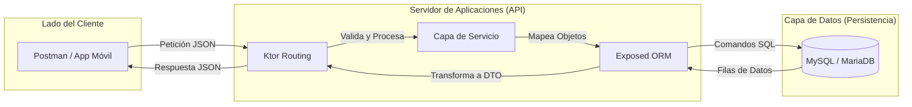

# Arquitectura y Despliegue de la API REST

Llegar al final del desarrollo implica saber cómo empaquetar nuestro trabajo para que pueda ejecutarse de forma independiente. En este módulo analizaremos la arquitectura final y las dos formas principales de despliegue con Gradle.

---

## 1. Arquitectura de la Aplicación

### ¿Qué estamos haciendo?

Estamos separando las responsabilidades de nuestro sistema. Nuestra arquitectura no es un bloque sólido, sino una cadena de componentes donde cada uno tiene una frontera clara.

### ¿Para qué sirve?

Esta separación permite que nuestra **API (Lógica)** sea independiente de la **Base de Datos (Almacenamiento)**. Podríamos tener el servidor en la nube y la base de datos en otro servidor distinto, y la aplicación seguiría funcionando perfectamente.

### Visualización del Flujo y Fronteras



---

## 2. Empaquetado como "Fat JAR" (buildFatJar)

### ¿Qué es?

Es la técnica de meter todo lo necesario (código + todas las librerías externas) dentro de un único archivo `.jar`.

### Ventajas:

* Es extremadamente sencillo de transportar: **un solo archivo**.
* Se ejecuta con un simple comando: `java -jar mi-app.jar`.

### ¿Cómo se genera?

Utilizamos el script del Gradle Wrapper que garantiza que todos usemos la misma versión de Gradle.

```bash
# Limpia compilaciones previas y genera el JAR único
./gradlew clean buildFatJar
```
*Ubicación:* `build/libs/nuestro-proyecto-all.jar`

---

## 3. Empaquetado como Distribución (installDist)

### ¿Qué es?

A diferencia del Fat JAR, `installDist` crea una carpeta con una estructura profesional. Separa nuestro código de las librerías (en una carpeta `lib`) y genera archivos ejecutables (`.bat` para Windows y un script `sh` para Linux/Mac).

### ¿Para qué sirve?

Es la forma preferida para despliegues reales en servidores Linux o Docker, ya que:

1. Permite actualizar solo nuestro código sin reenviar todas las librerías (que suelen pesar más).
2. Proporciona scripts de arranque configurables.

### ¿Cómo se genera?

```bash
./gradlew installDist
```

### ¿Dónde está el resultado?

Navega a la carpeta: `build/install/nombre-del-proyecto/`

* En `bin/` encontrarás el ejecutable.
* En `lib/` encontrarás todos los archivos JAR de las dependencias.

---

## 4. El Ciclo de Vida: El error del arranque

!!! danger "Recuerda el punto de conexión"
    Si ejecutas tu JAR o tu Distribución y las rutas fallan, revisa que `ConexionDB.conectar()` esté dentro de la función `module()` en `Application.kt`.

### ¿Por qué?

Cuando lanzas el servidor fuera de IntelliJ, el motor de Ktor toma el control total. Si la conexión a la base de datos no está "dentro" del motor de Ktor, el servidor levantará, pero la base de datos estará "apagada".

```kotlin
// Correcto en Application.kt
fun Application.module() {
    ConexionDB.conectar() // Se ejecuta al arrancar el motor
    configureSerialization()
    configureRouting()
    ...
}
```

---

## 5. Comparativa de Despliegue

| Característica | buildFatJar | installDist |
| :--- | :--- | :--- |
| **Resultado** | Un archivo único `.jar` | Carpeta con `bin` y `lib` |
| **Portabilidad** | Alta (un solo archivo) | Media (necesitas la carpeta) |
| **Uso común** | Pruebas rápidas, Microservicios | Despliegue en servidores, Docker |
| **Ejecución** | `java -jar app.jar` | `./bin/app` |

---

## 🎯 Práctica 6. Despliegue

!!! warning "Práctica para Aplicar"
    1. Ejecuta `./gradlew clean installDist`.
    2. Ve a la carpeta `build/install/.../bin` y ejecuta tu aplicación mediante el script (sin usar `java -jar`).
    3. Comprueba en Postman que la API responde.
    4. Observa la carpeta `lib` y cuenta cuántas dependencias ha necesitado Ktor para funcionar.
    5. **Misión Final:** Genera el Fat JAR y envíaselo a un compañero para ver si puede ejecutar tu API conectándose a tu base de datos (¡siempre que la IP sea accesible!).
