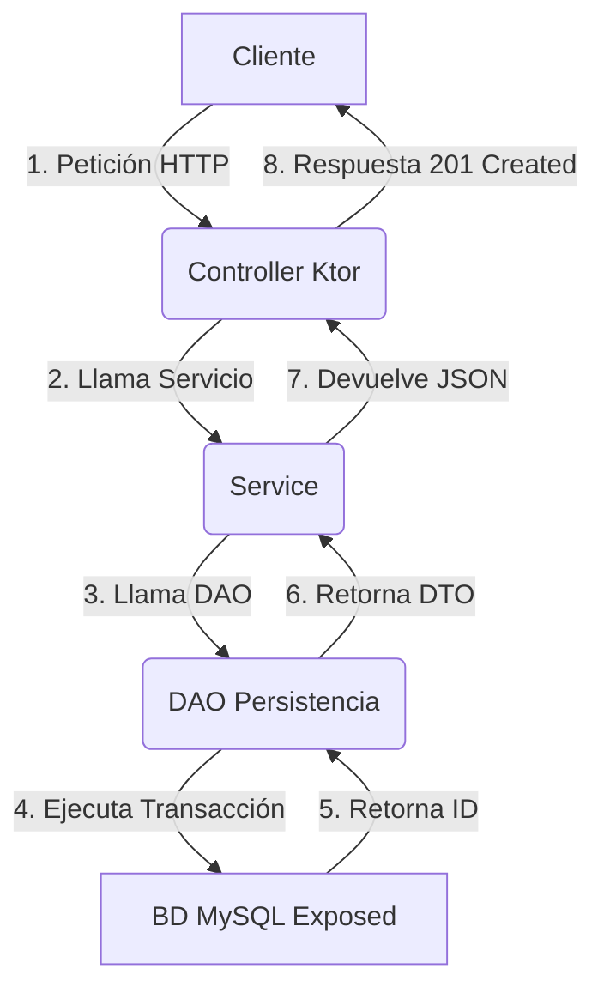
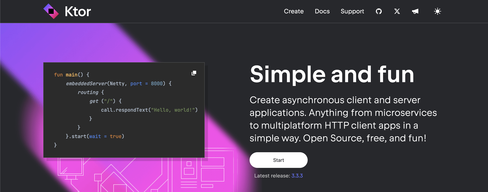
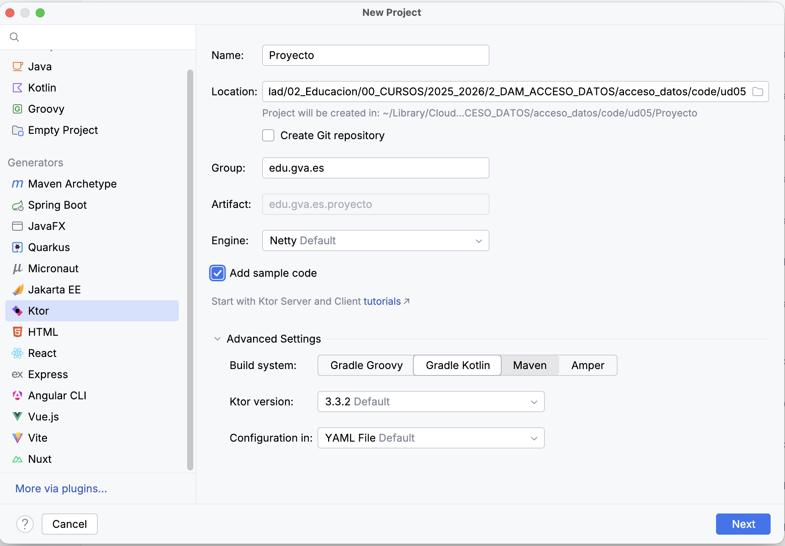
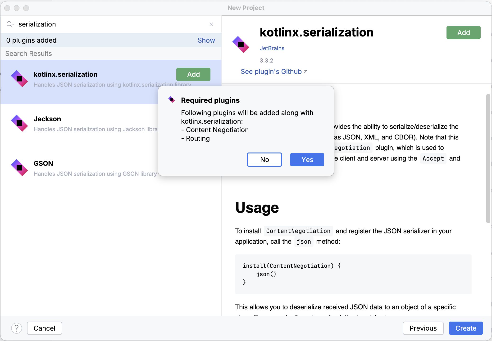
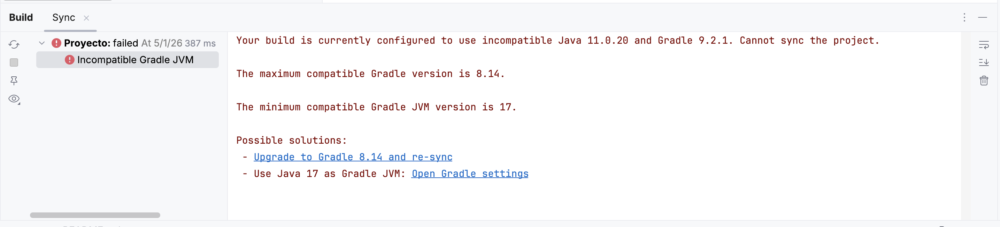
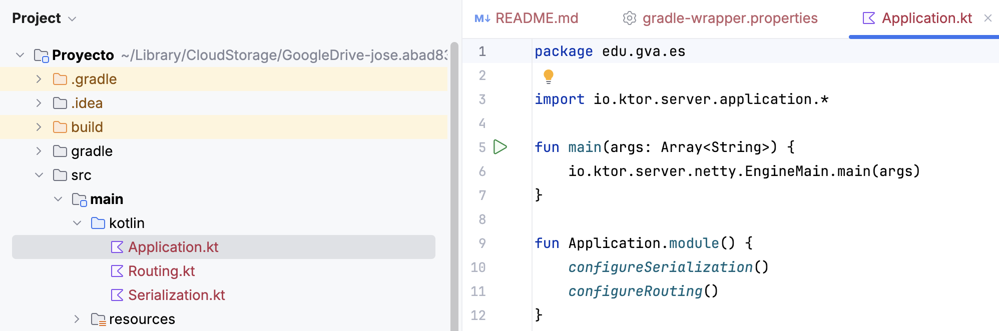
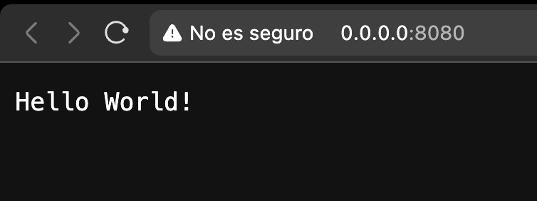

# Unidad 5. Diseño de componentes. API REST

## Guía de Uso

Estos apuntes están diseñados para un aprendizaje práctico. A lo largo de la unidad se aplicarán los conceptos teóricos para construir, paso a paso, una aplicación completa de gestión de datos.

La temática de la aplicación es de libre elección, pero la estructura y los pasos a seguir serán comunes. Intercaladas con la teoría y los ejemplos, se utilizarán las siguientes cajas de contenido:

!!! success "🔍 Ejecutar y Analizar"
    Contienen fragmentos de código que deben ser ejecutados y comprendidos en detalle. El objetivo es observar su funcionamiento y salida.

!!! warning "🎯 Práctica para Aplicar"
    Indican la necesidad de programar y aplicar los conceptos aprendidos para avanzar en el desarrollo del proyecto personal.

!!! danger "📁 Entrega"
    Marcan los puntos de entrega del trabajo, que serán revisados y calificados por el profesor.

## 1. Introducción a las APIs REST

Una **API REST (Representational State Transfer)** es un conjunto de principios arquitectónicos que definen cómo los sistemas de software en la web se comunican entre sí. Se basa en el concepto de **recursos**, que son entidades (como `usuario`, `producto`, `tarea`) accesibles a través de URLs.

### 1.1 Elementos Clave

| Elemento | Descripción | Ejemplo |
| :--- | :--- | :--- |
| **Recurso** | Una entidad a la que se accede, identificada por una URL. | `/usuarios`, `/usuarios/5` |
| **Verbos HTTP** | Indican la acción que se desea realizar sobre el recurso (CRUD). | GET, POST, PUT, DELETE |
| **Representación** | El formato en que se envía o recibe el recurso (JSON o XML). | `{"id": 1, "nombre": "Atenea"}` |
| **Códigos de Estado** | Indican el resultado de la operación (éxito, error, etc.). | 200 OK, 201 Created, 404 Not Found |

### 1.2 Verbos HTTP y CRUD

| Verbo HTTP | Operación CRUD | Descripción | Ejemplo de Ruta |
| :--- | :--- | :--- | :--- |
| **GET** | Read (Lectura) | Recuperar uno o varios recursos. | `GET /usuarios` |
| **POST** | Create (Creación) | Crear un nuevo recurso. | `POST /usuarios` |
| **PUT** | Update (Actualización) | Reemplazar completamente un recurso. | `PUT /usuarios/5` |
| **DELETE** | Delete (Borrado) | Eliminar un recurso específico. | `DELETE /usuarios/5` |

---

## 2. El Patrón Modelo-Vista-Controlador (MVC)

El patrón **MVC** es la columna vertebral de nuestra arquitectura. Su objetivo es separar las responsabilidades de la aplicación en tres capas interconectadas para mejorar la modularidad y la escalabilidad.

### 2.1 Componentes y Mapeo a Ktor/Exposed

| Componente | Rol en MVC | Mapeo en Ktor/Exposed | Unidad y Archivo |
| :--- | :--- | :--- | :--- |
| **Modelo (M)** | Gestión de datos y lógica de persistencia. | **Capa DAO (Exposed) y DTOs.** | Unidad 4: `UsuariosDAO.kt` |
| **Controlador (C)** | Recibe peticiones HTTP, delega la lógica y devuelve la respuesta. | **Rutas Ktor (`route { ... }`) y Capa de Servicio.** | Unidad 5: `UsuarioRoutes.kt` |
| **Vista (V)** | Formato de presentación de los datos al usuario. | **Serialización JSON** (Usando `ContentNegotiation`). | Unidad 5: Respuestas JSON |

### 2.2 Diagrama del Flujo MVC con Ktor/Exposed

El flujo de una petición (por ejemplo, `POST /usuarios`) sigue una ruta clara a través de las capas:

---

## 3. Configuración Inicial de un Proyecto Ktor

### ¿Qué es Ktor?

**Ktor** es un framework de código abierto creado por **JetBrains** (los mismos creadores de Kotlin e IntelliJ) diseñado para construir aplicaciones conectadas de forma rápida, asíncrona y eficiente. A diferencia de otros frameworks más pesados, Ktor destaca por:

* **Asincronía nativa:** Utiliza corrutinas de Kotlin para manejar miles de conexiones simultáneas con un consumo mínimo de recursos.
* **Modularidad (Plugins):** No carga nada que no necesites. Si quieres usar JSON, instalas el plugin de serialización; si quieres seguridad, instalas el de autenticación. Esto lo hace extremadamente ligero.
* **Kotlin puro:** Está escrito desde cero en Kotlin, lo que nos permite usar todas las ventajas del lenguaje (DSL, tipado fuerte, funciones de extensión) de forma natural.

Necesitamos una estructura base simple de Ktor que nos permita organizar estas potentes funcionalidades.

### 3.1 Creación del Proyecto con IntelliJ Wizard

La forma más sencilla y profesional de empezar es utilizando el asistente de proyectos de IntelliJ IDEA. Sigue estos pasos:

1. **Nuevo Proyecto:** Selecciona File > New > Project... y elige Ktor en el menú de la izquierda.

   

2. **Configuración Básica:**
    * Name: El nombre de tu aplicación.
    * Build System: Selecciona Gradle Kotlin.
    * Engine: Usaremos Netty (es el motor de servidor más robusto y común).
3. **Selección de Plugins (Añadir dependencias):** En la siguiente pantalla del asistente, debemos buscar e instalar los siguientes plugins esenciales:
    * Routing: Para poder definir las rutas (/usuarios, etc.) de nuestra API.
    * Content Negotiation: Fundamental para que el servidor pueda "negociar" el formato de los datos (JSON).
    * kotlinx.serialization: El motor que convertirá nuestros objetos Kotlin a JSON automáticamente.

    

    !!! info "Resolución de errores"
        Es posible que la consola nos muestre algún error de versiones. Sólo tienes que pulsar en el primer enlace de *Possible solutions* para solucionarlo.

        

4. **Estructura inicial:** Ahora nuestro proyecto está preparado para **Ktor**. Fíjate que nos ha creado una serie de archivos inciales (iremos modificando la estructura del proyecto).
   

Al finalizar, IntelliJ generará toda la estructura de archivos necesaria y configurará el *build.gradle.kts* por ti.

Para testear que todo ha ido bien, lanza la función **main** del archivo **Application.kt**. Mostrará una ruta donde el servidor de tu API esté funcionando y *escuchando* peticiones (por ejempo, http://0.0.0.0:8080).

Haz click y se abrirá un navegador con nuestro primer *Hello world!*

## 🎯 Práctica 1. Creación del Proyecto con Ktor

!!! warning "🎯 Práctica para Aplicar"
    1. Crea tu nuevo proyecto Ktor siguiendo los pasos del asistente mencionados arriba.
    2. Una vez generado, localiza el archivo Application.kt dentro de la carpeta core o plugins (dependiendo de la versión).
    3. Explora el archivo Routing.kt y modifica el mensaje de la ruta principal con un mensaje personalizado.
