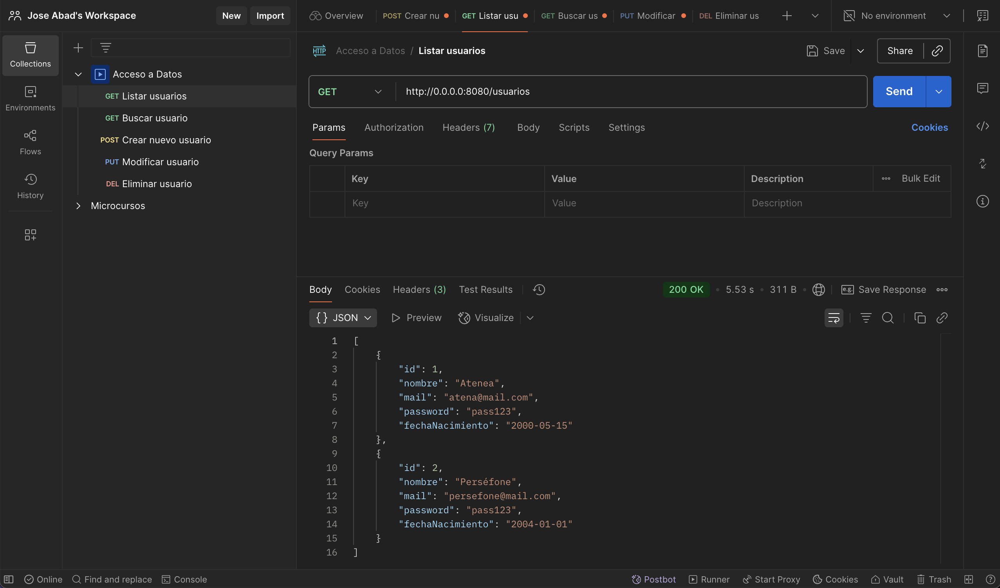
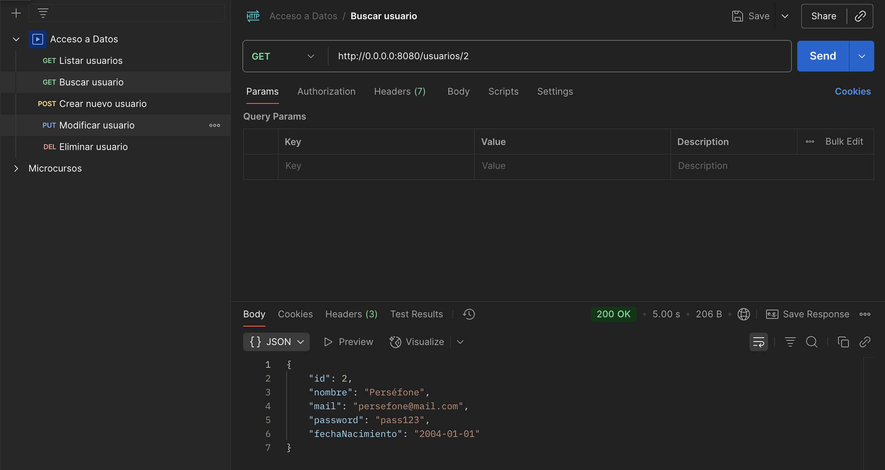
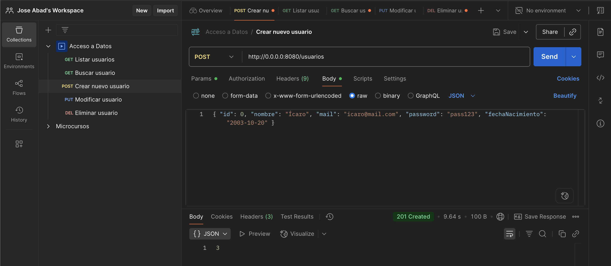
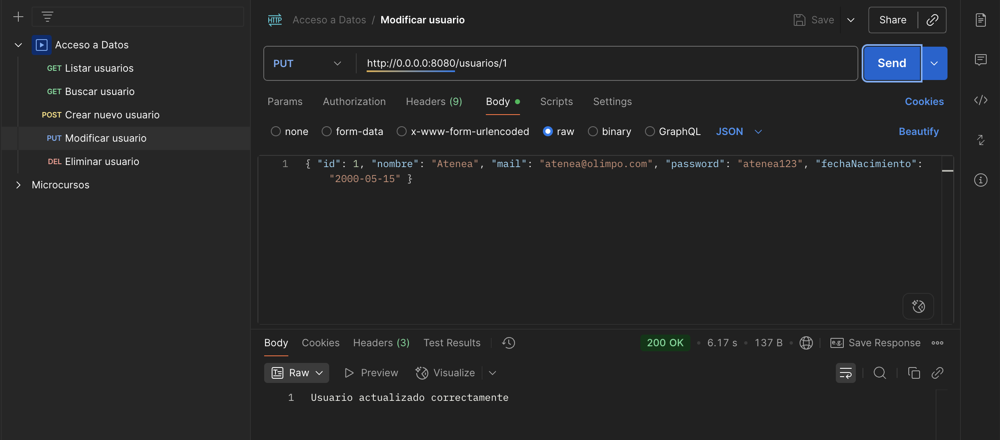
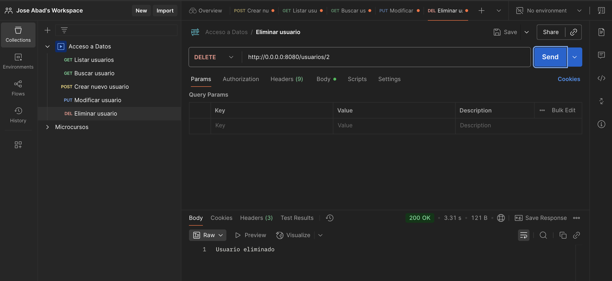

# Rutas. Implementación del CRUD Completo

En este apartado vamos a construir las **Rutas (Routing)** de nuestra API. El objetivo es que nuestro servidor Ktor sea capaz de recibir peticiones HTTP, usar el Servicio para procesarlas y devolver respuestas en formato JSON.

## 1 Estructura del Routing en Ktor

### ¿Qué estamos haciendo?

Estamos definiendo los "puntos de entrada" (*endpoints*) de nuestra aplicación. En Ktor, el sistema de rutas se configura como un "Plugin" que escucha las peticiones que llegan al servidor.

### ¿Para qué sirve?

Separar las rutas del motor principal del servidor permite que el código sea modular. En lugar de tener un archivo gigante con todas las URLs, creamos pequeñas funciones de extensión que agrupan rutas por "recurso" (ej: usuarios, productos, facturas).

Utilizaremos el archivo `plugins/Routing.kt` para definir cómo responde nuestra API.

!!! success "🔍 Ejecutar y Analizar"
    Abre `plugins/Routing.kt` y observa la estructura. Vamos a delegar la lógica de los usuarios a una función de extensión para mantener el código limpio.

```kotlin
package com.tu.proyecto.plugins

import com.tu.proyecto.routes.usuarioRouting
import io.ktor.server.application.*
import io.ktor.server.routing.*

fun Application.configureRouting() {
    routing {
        // Registramos las rutas de usuarios
        usuarioRouting()
    }
}
```

## 2 El Controlador de Usuarios: `routes/UsuarioRoutes.kt`

Implementamos las 5 operaciones fundamentales. El controlador recibe objetos `Call` (la llamada del cliente), extrae información (parámetros o cuerpo JSON) y delega el trabajo al **Servicio**.

El controlador actúa como un "traductor":

* Convierte lo que viene de la red (texto JSON) en objetos Kotlin (`call.receive`).
* Convierte los objetos de nuestra lógica en respuestas para la red (`call.respond`).

Aquí es donde ocurre la magia. Definiremos los 5 endpoints clásicos de un CRUD RESTful.

!!! success "🔍 Ejecutar y Analizar"
    Crea el archivo `UsuarioRoutes.kt` en la carpeta `routes`. Analiza cómo usamos `call.respond` para enviar datos y `call.receive` para leerlos.

```kotlin
package com.tu.proyecto.routes

import com.tu.proyecto.services.UsuariosService
import com.tu.proyecto.domain.UsuarioDTO
import io.ktor.http.*
import io.ktor.server.application.*
import io.ktor.server.request.*
import io.ktor.server.response.*
import io.ktor.server.routing.*

fun Route.usuarioRouting() {
    
    // El controlador llama al Servicio, NUNCA directamente al DAO
    val service = UsuariosService 

    route("/usuarios") {
        
        // 1. GET: Obtener todos (Lectura)
        get {
            val lista = service.listarUsuarios()
            call.respond(lista) // Ktor convierte automáticamente la lista a JSON
        }

        // 2. GET/{id}: Obtener uno específico (Lectura)
        get("{id}") {
            val id = call.parameters["id"]?.toIntOrNull() 
                ?: return@get call.respondText("ID no válido", status = HttpStatusCode.BadRequest)
            
            val usuario = service.buscarPorId(id)
            if (usuario != null) {
                call.respond(usuario)
            } else {
                call.respondText("Usuario no encontrado", status = HttpStatusCode.NotFound)
            }
        }

        // 3. POST: Crear nuevo (Escritura)
        post {
            try {
                // Importante: El JSON debe coincidir con el DTO
                val usuario = call.receive<UsuarioDTO>()
                val nuevoId = service.registrarUsuario(usuario)
                
                if (nuevoId != -1) call.respond(HttpStatusCode.Created, nuevoId)
                else call.respond(HttpStatusCode.Conflict, "El email ya existe")
            } catch (e: Exception) {
                call.respondText("Error en los datos: ${e.message}", status = HttpStatusCode.BadRequest)
            }
        }

        // 4. PUT/{id}: Actualizar (Modificación)
        put("{id}") {
            val id = call.parameters["id"]?.toIntOrNull() 
                ?: return@put call.respondText("ID no válido", status = HttpStatusCode.BadRequest)
            
            val usuarioActualizado = call.receive<UsuarioDTO>()
            val filas = service.actualizarUsuario(id, usuarioActualizado)
            
            if (filas > 0) {
                call.respondText("Usuario actualizado correctamente")
            } else {
                call.respondText("No se pudo actualizar: Usuario no encontrado", status = HttpStatusCode.NotFound)
            }
        }

        // 5. DELETE/{id}: Borrar (Eliminación)
        delete("{id}") {
            val id = call.parameters["id"]?.toIntOrNull() 
                ?: return@delete call.respondText("ID no válido", status = HttpStatusCode.BadRequest)
            
            val eliminado = service.borrarUsuario(id)
            if (eliminado > 0) {
                call.respondText("Usuario eliminado", status = HttpStatusCode.OK)
            } else {
                call.respondText("Usuario no encontrado", status = HttpStatusCode.NotFound)
            }
        }
    }
}
```

### Estructura de Directorios Resultante

Para implementar este controlador, nuestro proyecto debe estar organizado de la siguiente manera:

```text
src/main/kotlin/com/tu.proyecto/
├── core/
│   └── ConexionDB.kt    // M: Persistencia
├── data/
│   ├── UsuariosTable.kt // M: Mapeo
│   └── UsuariosDAO.kt   // M: CRUD Exposed
├── domain/
│   ├── UsuarioDTO.kt    // M: Modelo Serializable
│   └── LocalDateSerializer.kt
├── services/
│   └── UsuariosService.kt // M: Lógica de Negocio
├── routes/              // CAPA CONTROLADOR (C)
│   └── UsuarioRoutes.kt // Definición de Endpoints
├── plugins/
│   ├── Serialization.kt // V: Vista JSON
│   └── Routing.kt       // Punto de anclaje de rutas
└── Application.kt       // Orquestador
```

## 3 Semántica de las Respuestas HTTP

Estamos asignando un código numérico a cada respuesta. Una buena API no solo devuelve datos, sino que explica qué ha pasado mediante el estándar HTTP.

### Tabla de Códigos de Estado

| Código | Nombre | Significado Teórico | Cuándo usarlo en nuestra API |
| :--- | :--- | :--- | :--- |
| **200** | OK | Petición exitosa. | En `GET` (lista o uno) y `PUT` / `DELETE` exitosos. |
| **201** | Created | Recurso creado con éxito. | Siempre tras un `POST` que inserte un registro. |
| **400** | Bad Request | Petición mal formada. | Si el cliente envía un ID que no es un número. |
| **404** | Not Found | No encontrado. | Si buscamos, editamos o borramos un ID inexistente. |
| **409** | Conflict | Conflicto en el servidor. | Si intentan registrar un email que ya existe. |
| **500** | Internal Error | Error no controlado. | Cuando nuestro código falla (excepción no capturada). |

## 4 Probando la API

Utilizamos herramientas externas para simular ser un cliente (un móvil o una web) que consume nuestra API.

Dado que una API REST no tiene "botones" ni "pantallas", necesitamos enviar peticiones manuales para verificar que el flujo **Controlador -> Servicio -> DAO -> BD** funciona correctamente de principio a fin.

!!! success "🔍 Herramientas recomendadas"

    * **Postman:** La herramienta estándar de la industria. [Accede a su página oficial](https://www.postman.com/)
    * **IntelliJ HTTP Client:** Muy útil para dejar las pruebas guardadas en el propio proyecto (ficheros `.http`).

### 4.1 Tabla de Endpoints y Pruebas

Antes de comenzar con las pruebas, vamos a acceder a nuestra BD y vamos a insertar (con SQL) usuarios de prueba:

```sql
INSERT INTO usuarios(nombre,mail,password,fecha_nacimiento)
VALUES ("Atenea","atena@mail.com","pass123","2000-05-15");

INSERT INTO usuarios(nombre,mail,password,fecha_nacimiento)
VALUES ("Perséfone","persefone@mail.com","pass123","2004-01-01");
```

La siguiente tabla muestra las peticiones que vamos a testear en `http://0.0.0.0:8080`:

| Método | URL (Endpoint) | Parámetros / Body (JSON de ejemplo) | Objetivo |
| :--- | :--- | :--- | :--- |
| **GET** | `/usuarios` | Ninguno | Obtener la lista de todos los usuarios. |
| **GET** | `/usuarios/1` | `id=1` en la URL | Ver detalles del usuario con ID 1. |
| **POST** | `/usuarios` | `{ "id": 0, "nombre": "Ícaro", "mail": "icaro@mail.com", "password": "pass123", "fechaNacimiento": "2003-10-20" }` | Crear un nuevo usuario. |
| **PUT** | `/usuarios/1` | `{ "id": 1, "nombre": "Atenea", "mail": "atenea@olimpo.com", "password": "atenea123", "fechaNacimiento": "2000-05-15" }` | Modificar los datos del usuario 1. |
| **DELETE** | `/usuarios/2` | `id=1` en la URL | Eliminar permanentemente al usuario 2. |

!!! info "Nota sobre el JSON"
    Recuerda que en el `POST` y `PUT` debes configurar en Postman el tipo de cuerpo como **raw** y seleccionar **JSON**. Asegúrate de que los nombres de los campos coinciden exactamente con tu `UsuarioDTO`.

#### Listar todos los usuarios

La primera petición `http://0.0.0.0:8080/usuarios` usando el método **GET** nos devolverá la lista de todos los usuarios de la BD.



#### Buscar usuario por `id`

Podemos realizar una búsqueda por `id`. La petición la haremos por **GET** a la url `http://0.0.0.0:8080/usuarios/2` (para buscar el usuario con `id` igual a `2`).



#### Crear un nuevo usuario

En esta ocasión, vamos a insertar datos en nuestra BD. Para ello, por seguridad, el envío de parámetros lo realizamos usando el método **POST**. Los parámetros, en vez de ir concatenados en la URL como en el método **GET**, irán encapsulados dentro del cuerpo de la petición.

Esto significa, que al servidor le enviaremos un *JSON* con los campos del nuevo registro a la URL `http://0.0.0.0:8080/usuarios`

Además, para asegurarnos de que el `id` se autoincremente, enviaremos por defecto el `id=0`. Con este truco, Ktor se quedará tranquilo porque el *JSON* es correcto y la BD ignorará el `id`.



> **Nota:** fíjate que el servidor nos ha devuelto el `id` del usuario nuevo creado.

#### Modificar un usario existente

Para este ejemplo, modificaremos el `mail` y el `password` del ususario con el `id` igual a 1. Usaremos una petición **PUT** a la URL `http://0.0.0.0:8080/usuarios/1`. En este caso (como con **POST**) enviaremos todos los datos del registro a modificar con un *JSON* dentro del cuerpo de la petición.



#### Eliminar usuario con `id`

Por último, vamos a realizar el borrado de un usuario según su `id`. La petición la haremos usando el método **DELETE** en la url `http://0.0.0.0:8080/usuarios/2`.



### 4.2 Corrección de errores

!!! danger "¿Falla el POST/PUT/DELETE?"
    Si recibes errores al enviar datos, comprueba estos 3 puntos:

    1. **Content-Type:** En Postman, asegúrate de que el Body es `raw` -> `JSON`.
    2. **El ID en el JSON:** Tu `UsuarioDTO` tiene un campo `id`. Si en el POST no lo envías, Ktor fallará. **Truco:** Envía un `id: 0`, la base de datos lo ignorará y usará el autoincremental.
    3. **Formato Fecha:** Debe ser exactamente `"YYYY-MM-DD"`.

| Método | Endpoint | Body (JSON) Ejemplo |
| :--- | :--- | :--- |
| **POST** | `/usuarios` | `{ "id": 0, "nombre": "Ícaro", "mail": "icaro@mail.com", "password": "pass123", "fechaNacimiento": "2003-10-20" }` |
| **PUT** | `/usuarios/1` | `{ "id": 1, "nombre": "Atenea", "mail": "atenea@olimpo.com", "password": "atenea123", "fechaNacimiento": "2000-05-15" }` |
| **DELETE** | `/usuarios/2` | (Vacío) |

## 🎯 Práctica 4. Enrutando y realización de pruebas.

!!! warning "🎯 Práctica para Aplicar"
    1. Implementa el archivo `UsuarioRoutes.kt` y asegúrate de registrarlo en `Routing.kt`.
    2. Ejecuta el servidor.
    3. Utiliza la herramienta Postman para realizar todas las pruebas:
          1. Listar todos los usuarios (GET).
          2. Buscar un usuario por `id` (GET).
          3. Crear un usuario nuevo (POST).
          4. Modificar datos de un usuario existente (PUT).
          5. Eliminar un usuario (DELETE).
    4. Realiza todas las pruebas posibles (mails duplicados, buscar un usuario que no existe, etc.).
    5. Verifica que tras las modificaciones, el listado **GET** devuelve la lista con todos los usuarios y las alteraciones de la BD.
