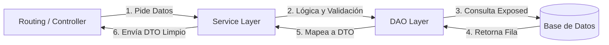
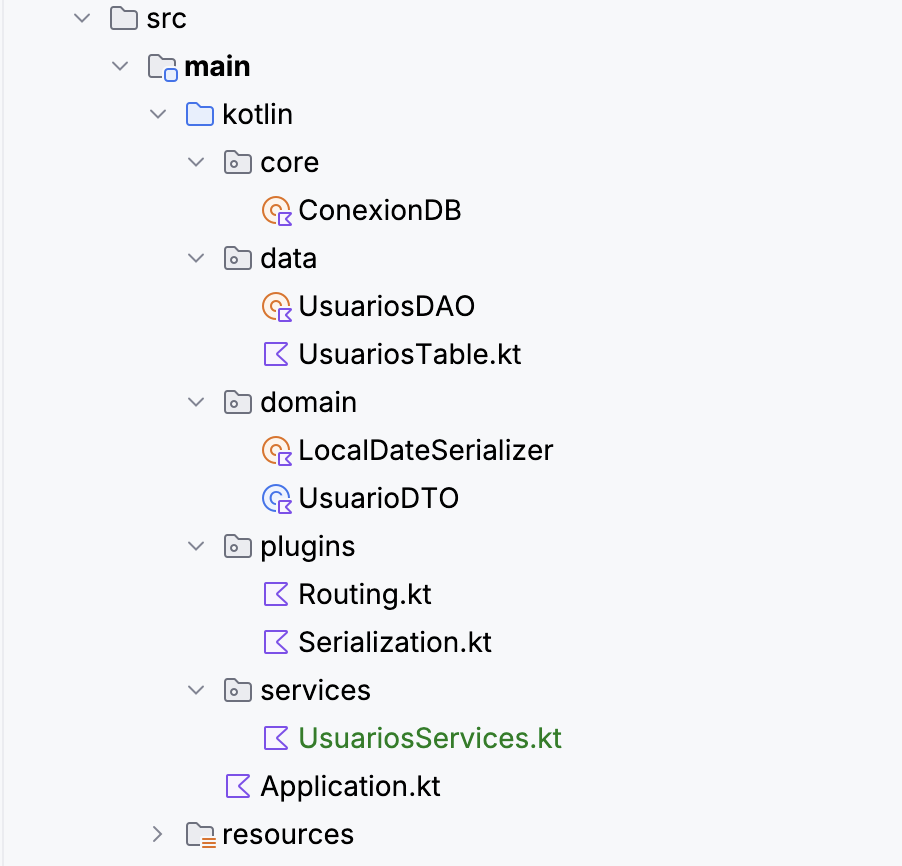

# Capa de Dominio y Servicios (CE d)

En los apartados anteriores hemos construido los cimientos (Base de Datos) y las herramientas de traducción (JSON). Ahora vamos a crear la **Capa de Servicio**, el lugar donde reside la lógica de nuestra aplicación.

## 1 La Necesidad de una Capa de Servicio

¿Por qué no llamar al `UsuariosDAO` directamente desde las rutas de Ktor? Aunque en aplicaciones muy pequeñas funciona, en entornos profesionales usamos una capa intermedia llamada **Service** por tres razones clave:

1. **Abstracción:** Si mañana cambiamos el DAO o usamos dos bases de datos distintas, el controlador (las rutas) no tiene por qué enterarse.
2. **Lógica de Negocio:** El DAO solo sabe hacer CRUD. El Servicio sabe, por ejemplo, que no se puede registrar a un usuario si el email ya existe o si es menor de edad.
3. **Seguridad:** Podemos filtrar datos sensibles o transformar objetos antes de que salgan a la red.

### Flujo de Comunicación

El siguiente gráfico representa cómo interactúan los componentes en nuestra arquitectura modular:



## 2 Implementación del Servicio: `UsuariosService.kt`

El Servicio es el "empleado" que recibe órdenes del Controlador y utiliza al "especialista" (DAO) para ejecutarlas.

!!! success "🔍 Ejecutar y Analizar"
    Crea el archivo `UsuariosService.kt` en la carpeta `services`. Observa cómo esta capa gestiona la lógica antes de tocar la base de datos.

```kotlin
package edu.gva.es.services

import edu.gva.es.data.UsuariosDAO
import edu.gva.es.domain.UsuarioDTO

/**
 * Capa de Servicio: Aquí reside la lógica de negocio.
 * Se encarga de validar datos y coordinar las llamadas al DAO.
 */
object UsuariosService {

    /**
     * Obtiene todos los usuarios. Podría aplicar filtros o lógica adicional.
     */
    fun listarUsuarios(): List<UsuarioDTO> {
        return UsuariosDAO.seleccionarTodos()
    }

    /**
     * Busca un usuario por ID.
     */
    fun buscarPorId(id: Int): UsuarioDTO? {
        return UsuariosDAO.seleccionarPorId(id)
    }

    /**
     * Lógica para crear un usuario.
     * Aquí podríamos verificar si el email ya existe antes de insertar.
     */
    fun registrarUsuario(usuario: UsuarioDTO): Int {
        // Ejemplo de regla de negocio: Comprobar si el mail ya está en la lista
        val existe = UsuariosDAO.seleccionarTodos().any { it.mail == usuario.mail }
        if (existe) return -1
        
        return UsuariosDAO.insertar(usuario)
    }

    /**
     * Actualiza un usuario existente.
     */
    fun actualizarUsuario(id: Int, usuario: UsuarioDTO): Int {
        return UsuariosDAO.actualizar(id, usuario)
    }

    /**
     * Elimina un usuario.
     */
    fun borrarUsuario(id: Int): Int {
        return UsuariosDAO.eliminar(id)
    }
}
```

## 3 El Contrato de API: DTOs Serializables

Como vimos en el módulo 5.2, el **UsuarioDTO** es nuestro contrato. Es la promesa de cómo se ven los datos tanto para el cliente (Frontend) como para el servidor.

!!! success "🔍 Recordatorio del Modelo de Dominio"
    Asegúrate de que tu `UsuarioDTO.kt` sea el único objeto que viaja entre el Servicio y el Controlador. Esto mantiene la **Capa de Datos** (Tablas y Rows) totalmente oculta para el exterior.

## 4 Estructura de Carpetas Actualizada

Con la incorporación de los servicios, nuestra arquitectura modular queda así:

```text
src/main/kotlin/com/tu.proyecto/
├── core/
│   └── ConexionDB.kt    
├── data/
│   ├── UsuariosTable.kt 
│   └── UsuariosDAO.kt   
├── domain/              // CAPA DE DOMINIO
│   ├── UsuarioDTO.kt    
│   └── LocalDateSerializer.kt 
├── services/            // CAPA DE SERVICIO (Lógica de Negocio)
│   └── UsuariosService.kt   
├── plugins/
│   ├── Serialization.kt 
│   └── Routing.kt       
└── Application.kt       
```

---

## 🎯 Práctica 3. Creando la capa de Servicio

!!! warning "🎯 Práctica para Aplicar"
    1. Crea el paquete `services` en tu proyecto.
    2. Implementa el objeto `UsuariosService` siguiendo el ejemplo anterior.
    3. Reflexiona: ¿Qué otra regla de negocio podrías añadir? (Ej: Validar que el nombre no esté vacío o que la contraseña tenga una longitud mínima).

Llegados a este punto, el proyecto debe ser similar a esto:

